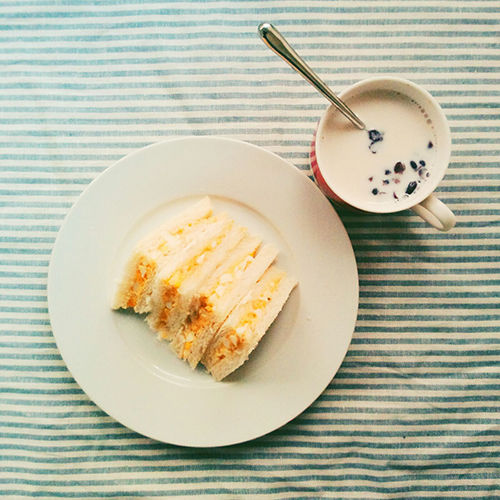
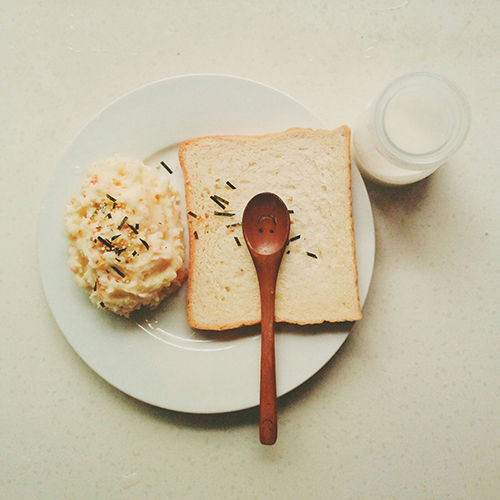
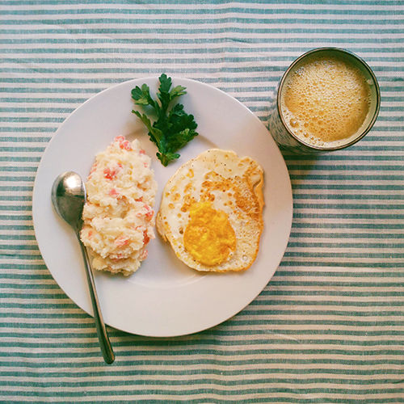
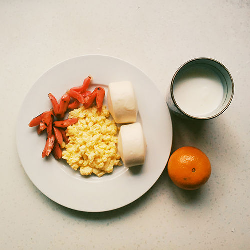
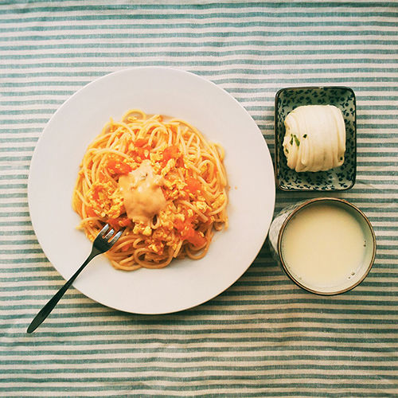

又到年关，整理旧文一篇，一年前的此时在家鼓捣的早餐心得。

寒假在家为了同时满足孤独的胃与虚荣心，做做美食拍拍照修修片儿不亦乐乎。不到两个月的时间回头一看倒积累了一堆花花绿绿的早餐照片，看起来就食欲满满，竟也对自己有些佩服起来。末了还摸索出好几种简单营养的早餐 Pattern，每天可以变着花样循环播放。记录在这里，就当手艺备忘了。

### 简单好吃零基础的鸡蛋三明治

鸡蛋三明治还是看《深夜食堂》的时候知道的，看着就很治愈的样子。

做法：煮一颗鸡蛋，剥皮，用勺子捣碎，拌入蛋黄酱，继续捣。捣好后涂在一片吐司上，涂均匀点，盖上另一片吐司，切边（不切也行），沿对角线切成四个小三角，装盘！搞定！个人觉得鸡蛋三明治是相当有成就感的一款早餐，原料也很省事，再配点牛奶水果什么的更赞！

### 夺命土豆泥

这个名字是在下厨房上看来的，确实很好吃啊，夺命的~

做法：把土豆去皮切块加水煮熟，要煮的烂烂的，用筷子一戳就能破的那种~然后还是捣（捣的时候加一点牛奶味道更好）！加沙拉酱，加火腿粒玉米粒各种粒还有一点点盐继续拌匀，就 ok 了。简单快手幸福感暴增！

### Scrambled egg 和章鱼香肠

Scrambled egg 其实就是炒蛋，洋气地说是美式炒蛋。不管正不正宗了，好吃才是硬道理；章鱼香肠也是从《深夜食堂》看来的。

做法：先准备炒蛋的原料，取鸡蛋打散加入一点盐和少量牛奶搅匀，先放在一边。  
把脆皮肠一端开十字口，平底锅放一点油烧热，放入脆皮肠，煎到开花（就是“章鱼”的触角卷起来），这个过程香肠的肠衣有点容易糊掉，要小心。煎好后出锅，锅里补一点点油，把之前准备的牛奶蛋液倒入锅中，半凝固时用筷子画圈搅拌（动作要快点，不然容易糊锅），鸡蛋全部凝固就可以盛起来装盘了。
再搭配一点主食，就是一份很赞的早餐了。

### 快手番茄鸡蛋意面

这个算是和妈妈尝试的自创做法，大概不是正宗的意面吃法，不过味道还不错呢。

做法：煮意面（在家一般是前一天晚上煮好），炒番茄鸡蛋（这个就不细说了），煮好的面倒进炒好番茄鸡蛋的锅中翻一翻混合一下，出锅，淋点番茄酱或千岛酱就 ok。

这个面当然也可以用普通的面条，那种就好像应该叫“番茄鸡蛋打卤面”？

**嗯，吃早餐才是一件很摇滚的事情！**

豆瓣相册：[吃早餐 · 壹](https://www.douban.com/photos/album/122387533)
知乎链接：[早餐应该怎样吃既营养又简单而且幸福感暴增？](http://www.zhihu.com/question/22066113/answer/21786222)
