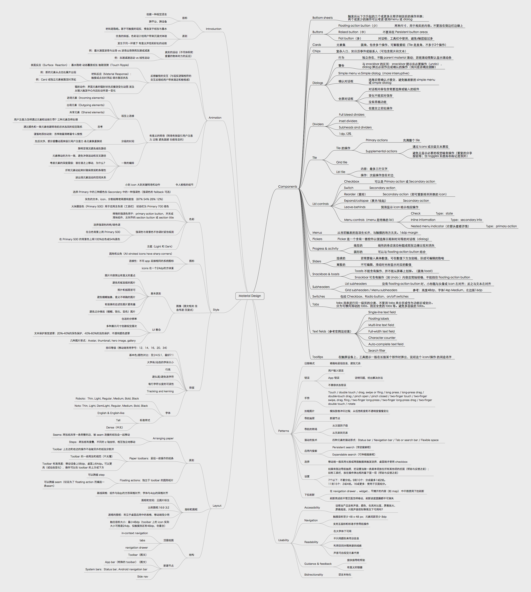

2014 年 Google 的 Material Design 从发布后就一直是互联网设计界的热门话题。扁平、材料、隐喻、 动效，这些词语成为了设计师们津津乐道的话题，也同时激起了一股 Android App Redesign 的热潮，比如这个： [Feedly 的重设计](https://medium.com/feedly-behind-the-curtain/an-exploration-in-material-design-by-feedly-8c1a1cbdfdcd)。

> At Google we say, 「Focus on the user and all else will follow」 ，We embrace that principle in our design by seeking to build experiences that surprise and enlighten our users in equal measure.

按照 Material Design 规范出壳的 App 视觉体验都不会太差，然而除去视觉这一单一感受，在这种新型设计语言的背后，是自成体系的一套理论支撑。它甚至重新定义了触摸这一动作的反馈意义，让每一个虚拟元素都能找到现实中经验主义的根据。在 Google 原生的系列 App 逐步用上 Material Design 后，大家纷纷开始惊叹：“原来 Android 也可以这么美！”

去年 9 月份就趁着热乎劲儿匆匆浏览过一遍[官方 Guideline](http://www.google.com/design/spec/material-design/introduction.html)，11 月偶然读到[ Loafer 所写的 Material Design 学习笔记](http://loaferwang.com/material-design-she-ji-gui-fan-xue-xi-xin-de/)。当时刚备好梯子能呼吸上墙外的新鲜空气，于是认真重读了一遍官方文档，记下重点，做成思维导图的形式，供自己梳理和日后查阅。

这篇读后笔记总结也算是欠下了两个多月才动笔，Material 的热潮有增无减，在此期间我也通过各种途径不断地了解、运用材料设计中主张的设计原则，所以现在去写，可能感受与认知比两个月前更加深刻一些。

个人整理的思维导图如下

### Material Design

纵观 Material 设计语言的规范，令我印象最深刻的就是 Google 对人类认知虚拟显示屏下的种种元素，所作出的系列有关易用性的探索。不管是纸张材料的隐喻，与现实逻辑相符的转场动效，还是各设备与平台的视觉统一，都是在深思熟虑之后，为人们在玻璃屏后的二维世界和现实三维世界之间，创造更加无缝的感知体验。

通俗地说，就是通过设计，让人们得以无障碍地理解、操作、掌控我们的智能设备，同时也不忽视其美学体验。

#### 隐喻

Material Design 受启发于传统的版式设计，以纸张为载体，通过优良的排版和色彩设计来展示内容，创造符合人们心理预期的界面。

纸张这一概念的引入我个人认为非常巧妙。智能设备是高科技的产物，人们对于其认知并没有很好的现实投射方式。就拿我的父母来说，智能手机是完全不同于报纸、杂志的物品，因为没有现实情感的投射，他们会感到是在被手机操纵，而不是像从纸上阅读一般地自身处于主动状态。纸张和墨水古已有之，人人都习惯从纸上阅读、获取信息，因此我认为，通过隐喻架设桥梁是一个蕴含着丝丝人情味的、与冰冷的科技握手言和的积极尝试。

Material 引入的 z 轴的概念，将屏幕上的二维世界三维化。

  

#### 动效

与单纯地纸张不同的是，在智能设备上，我们不仅是“读”，还要“互动”。方寸之间的世界需要展示的内容太多，触摸屏使得我们能够直接用双手去操纵屏幕上的元素，怎样去设计与现实逻辑相符的转场，是 Material Design 的一个重要核心。

我常常觉得，静态页面如果是 App 的骨架的话，合乎情理又兼顾美学的动效就是一个 App 的灵魂。因为有动效来指引转场路径，人们能更轻松地认知自己处于虚拟世界中的哪个位置，正在做什么，还能做些什么，真正让人们觉得那玻璃屏下地方寸之地是为我所操控的。

随着对动效的关注度逐渐增大，在越来越多的论坛中可以看到关于动效设计的方法与工具讨论。目前比较流行的两款 [Form](http://www.relativewave.com/form/) 和 [Origami 2.0](http://facebook.github.io/origami/) 受到很多设计师的追捧；两者在操作上有很多相似点，相较 AE、Keynote、Flash 这些工具，这两款的优势在于他们是以程序的思维在制作动效，新版 Origami 甚至支持代码导出（没试过，貌似听到说暂时此功能还有些鸡肋）；然而也正是这些属性多少增加了学习成本。

Origami 2.0 发布后我也开始跟着官方 Tutorials 学习，选择 Origami 的另一个原因是它的社区比 Form 更“热闹”一些，遇到问题可以通过问其他人来获得最快解决办法，把学习障碍最小化。另外 Origami 现在接轨了 Sketch，两者结合，有种珠联璧合的感觉。

动效工具的强大和 Material Design 的理念也是互相促进的，Origami 和 Material Design 的结合设计可以参考 Francis Cortez 的[这篇文章](https://medium.com/@makeshowlearn/origami-and-material-design-84f128e54938)。同样期待被 Google 收购的 Form 也能早日“繁荣”起来，并能支持 Android 设备预览，成为动效设计师和 Material Design 爱好者们的新宠~

#### 跨平台、跨设备

在 Andorid 5.0 以前，iOS 和 Android 可以说是互不相容的两个平台。由于界面交互逻辑的差异，一般在设计时需要考虑两个平台的不同特性。而 Material Design 的推出，将“平台”这个干扰因素的影响缩小了。Google 自家的许多应用的 iOS 版使用 Material 的设计语言，在 iOS 设备上也毫无违和感。采用 Material Design，可以轻松适应 iOS、Android，以及 Web 端和其他平台。

跨设备也是 Material Design 尝试去规范的问题之一。在 Components 一章中，Google 给出了不同界面元素的多平台统一规范，针对不同的设备特性和共通的理论基础给出指导原则。例如卡片这一元素，就是为适应不同平台设备、可自动组合排列而存在的，沿袭了“纸张”的理论，并加之现实中卡片的灵活属性。

智能手机、平板、PC、智能穿戴，今后的智能设备会越来越多样化，这就促使用户界面的元素分解，每一个 component 在不同尺寸的屏幕上又有统一却不完全同一的外观和逻辑。

### 总结

一直以来拟物和扁平是设计师们争论的话题，Material Design 引入的设计理念将二者融合，它既是扁平也是拟物的。当下大家都跟风似的为一些 Android App 套上 Material 的外观，其中不乏有十分优秀的应用，但大多数都是为了 material 而 material，任何界面都套用类似的元素与组合，比如画蛇添足的 Floating action button，毫无用途的 Side nav 等。

Material Design 虽然看上去很美，但滥用就会让你的设计变得很劣质，甚至在逻辑上完全说不通。设计的本心是为了使用的体验，需要兼顾逻辑、产品属性、交互等等很多因素，需要设计师去权衡考虑“我真的需要采用这个元素吗？”“这样做合乎情理吗？”“这个地方这么做的初衷是什么？”。学的目的在于“致用”，避免囫囵地拿来主义，如此这般只能永远依葫芦画瓢。真正理解了表层背后的原理，才能为自己的设计找到原由，这才是不忘设计的初心。
