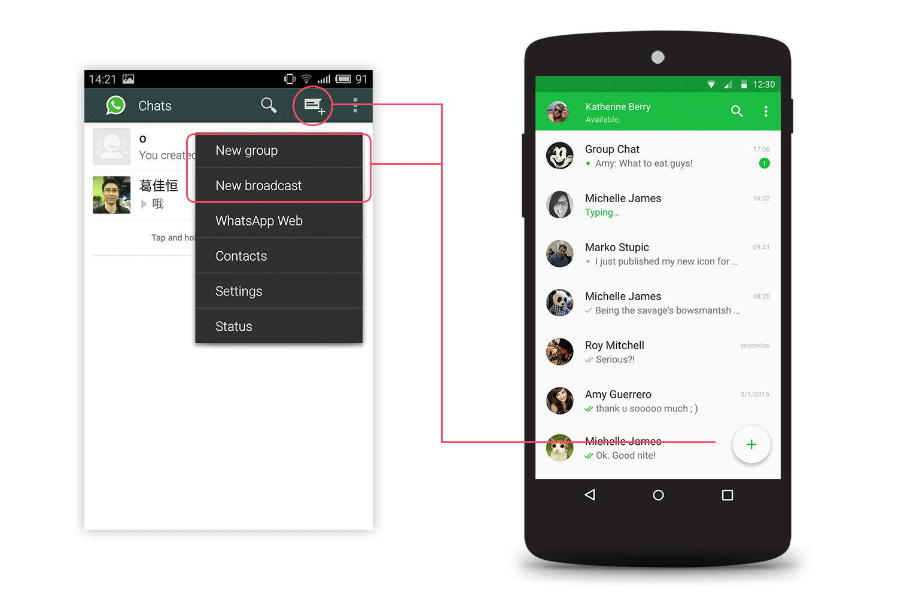
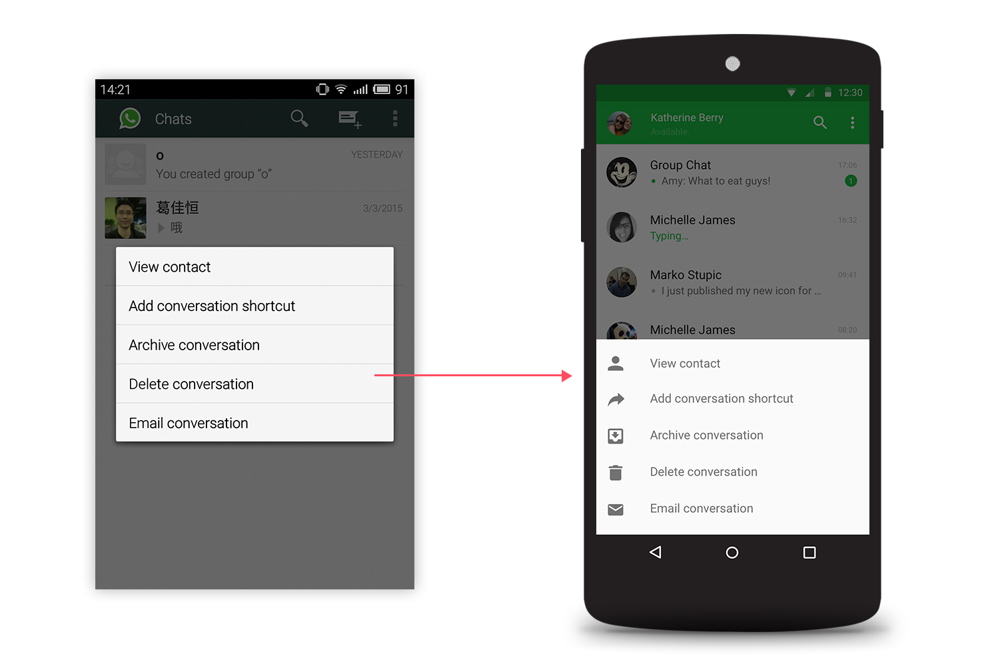
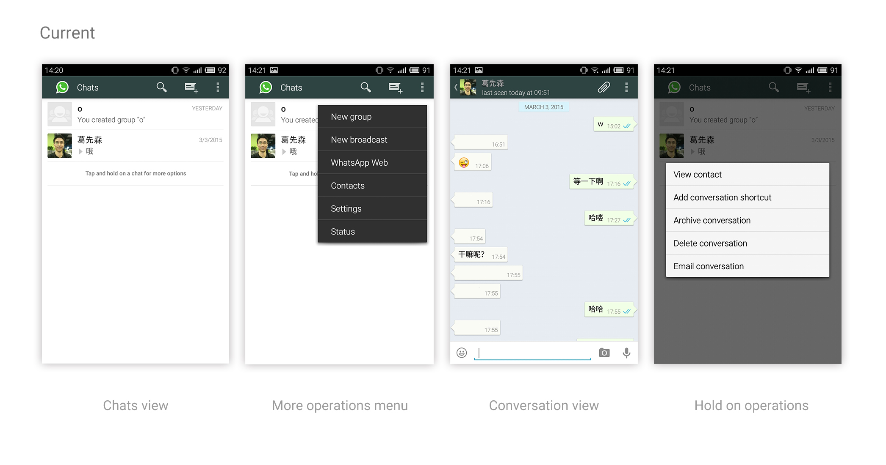
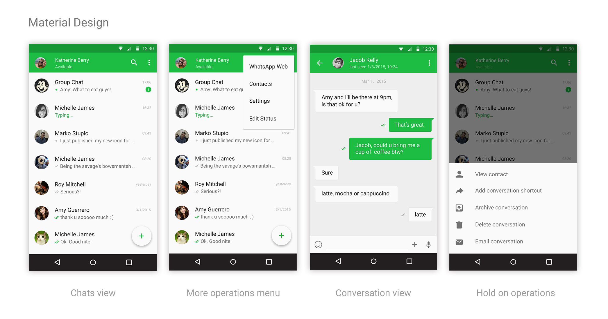

> WhatsApp Messenger 是一款利用网络发送短信的 APP，能够利用手机中的联系人信息，查找也有使用这个软件的联系人。WhatsApp 除了发送文字外，亦可以发送图片、录音、视频、用户的身处位置及联系人信息。在 2014 年 10 月，WhatsApp 于全球拥有超过 7 亿注册用户，其中包含约 6 亿活跃用户。——维基百科

前几年我用过一段时间的 WhatsApp，后来由于国内小伙伴们都去了微信的阵营，不能一起玩耍，于是最后在 1 年免费期限还没到的时候就没再用了。WhatsApp 属于功能型的应用，刚需比界面美不美更有杀伤力，所以长期以来，在还看得过去的外貌与稳定实时的信息功能结合下，WhatsApp 的用户量一直很有保障。

使用 WhatsApp 最深刻的印象是它对于信息发送状态的分类显示，能够实时看到发送的消息到哪了，大致归纳就有 5 种不同的用于标识消息状态的符号。

这次对 WhatsApp 的 Material Design 做得并不很全面，只是从「功能入口调整」和「界面优化」两个方面进行了重设计，算是一次尝试。

### 功能入口调整
目前的 WhatsApp 的消息列表页，Nav bar 主要有三个功能按钮「搜索」「新消息」「更多」，其中「更多」里包含了很多杂乱的功能入口，包括新群组、新广播、Web 版 WhatsApp、联系人、设置、状态共六项。另外添加「新消息」作为较为频繁使用的功能放置在屏幕最上方，不太方便单手操作。

考虑到「新消息」「新群组」「新广播」这三者都属于用户需要比较频繁用到的，且具备相似的「新增 XX」的属性，于是将其与 Floating Action Bar 做了结合，同时减轻「更多」唤出的菜单内容繁重的负担，，触摸 FAB 后唤出三个操作按钮，其中「消息（Message）」级别最高。几种功能入口的权重与 WhatsApp 现状符合，只是做了一些调配和体验上的优化。

在 WhatsApp 的消息列表页中，列表下方有一句长按消息唤出更多功能的提醒，长安后弹出的菜单给我的感觉是多且不直观。按照 Material Design 的指导原则，重新调整了弹出菜单，加上图标方便快速认知、快速视觉反应。

### 界面优化
WhatsApp 的 Nav bar 采用的深绿色可能是出于避免视觉干扰的考虑，用相对深的颜色来让用户专注于聊天本身，因此没有使用品牌的亮绿色；在其他一些聊天类软件中也通常是这样做的，比如微信。我在这次的重设计中还是采用了 WhatsApp Branding Green，绿色给人的疲劳感和焦躁感较小，在排版恰当的聊天界面中尝试一下也无妨。

为减少视觉噪音，用留白的方式来处理列表内的区域分割，尽量将内容作为视觉重点展示。

WhatsApp 全部界面对比图：

全部设计稿展示戳[这里](http://melodie-portfolio.lofter.com/post/1d10545c_61b44a3)

### 总结
这次的 Redesign 主要是对于 Material Design 的一些实践，比如 8dp 网格原则，UI 元素层级定义，设计稿中使用的组件有一些是基于 UI Kit。相较于在电脑上实现纸上构建的界面，着手开始设计前的思考更让我有收获，为了界面而画界面总是有些让人沮丧的事。

在 [Behance](https://www.behance.net/search?search=whatsapp) 上也看到很多设计师对于 WhatsApp Material Design 的尝试，并没有特别印象深刻之作，大多套用了 Side Nav，把「更多」里的功能入口一股脑全收在了侧边抽屉中，个人认为并不是最佳方案，甚至有些不太负责的感觉。我的重设计可能不算多好，但这个过程让我对 WhatsApp 本身的功能层级、体验设计有了更全面的认识。先要了解了，才评价或改变。

在 Redesign 中，也认识到一个道理：深层次去猜想、考量一款产品的用户依赖和诉求，然后用同理心去设计，追求视觉上的「新」和「炫」而做出来的设计可以练练手，却很难为实际工作提供参考经验。
