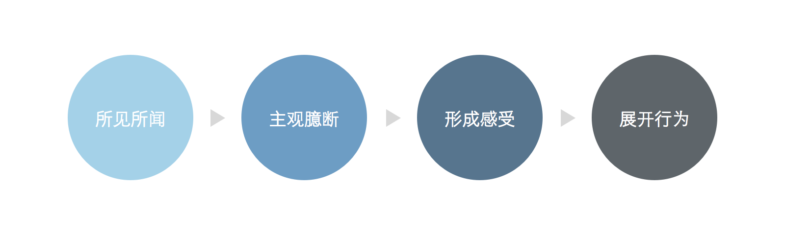

关键对话是什么？

> 关键对话是指那些两个或多个人之间进行的、会产生较大影响的讨论。必要条件：有分歧、事关重大、情绪激动。

作为设计师，使用关键对话技巧的情境在于，我们和其他人就设计产生分歧时，应该怎样应对？通常存在这么两种态度：

- 放弃争论，你说怎样就怎样吧。
- 非得争出个胜负不可；认为对方「根本不懂设计」，陷入僵局。

持有第一种态度的人，时间久了会产生无力感，还可能会倾向在背后吐槽、批评对方；第二种情况，通常会闹得双方不愉快，激动的情绪不利于问题的探讨和解决，更也不利于双方后续的合作。这两种态度，恰好就是《关键对话》一书中所提到的「傻瓜式选择」，即认为面对问题只能选择「逃避」或「对抗」。

那么，设计师如何在合作中与其他人理性对话？遇到观点相左的情况时，我们可以怎样主动化解僵局？

#### 从共同目标入手

> 我们的问题并不是行为本身是错误的，而是我们的动机有问题，即我们常常弄错要面对的目标。

《关键对话》中举了一个很简单的例子，说是作者的两个小女儿为了争抢谁先去洗手间争得面红耳赤，半个小时以后两人才达到和解上了洗手间。这个例子让我联想到设计师与需求方的一些矛盾。需求方说「我觉得这个用红色更好」，设计师说「这个地方用红色会很难看」，双方就一个是与否的问题展开争论，设计师觉得需求方不懂设计瞎指挥，需求方觉得设计师顽固不化难合作，通常情况下会以权力更大的一方「获胜」而另一方表面上的「屈服」收场。本可以双赢的境况往往败给了我们身而为人的争强好胜。

在书中例子中，我们可以看出作者的两个女儿的目的其实是相同的，都希望「尽快上洗手间」，但争执在无形中延迟了双方达到目的的时间。类似地，需求方想在这儿用红色，设计师如果问一句「为什么？」可能就会了解对方真正的目的，比如对方其实是觉得这部分的文字比较重要，需要更醒目的表达方式。这样一来，双方就可以一起为达到「更醒目」这个目的来想办法，而不是争论「是不是用红色」，陷入这一特定方案中去。

挖掘双方的共同目的，弄清自己希望为为双方的合作达到怎样的结果。

#### 尊重是前提

> 在对话中尊重感的丧失通常是因为我们认为对方和自己不同，是完全不一样的两种人。如果我们能把对方看成和自己差不多的人，这种感受便会自动消失。我们要做的不是为自己的行为找借口，而是努力理解对方，学会站在对方的角度看问题。

营造对话安全氛围的重要基础是「尊重」。

一般情况下，需求方提出的需求因为「在设计的角度显得不那么专业」会被设计师喷，「你根本不懂设计」成为设计师回避讨论的借口。其实，适当地把自己放低一些，跳离职位限定来探讨问题，会更容易获得有效的解决办法。每个人无论工种类别，只不过是更擅长各自的领域、思考问题的角度不同而已，互相尊重对方看问题的视角，同时用对方能理解的语言理性地阐述自己的理由，就能对问题有一个全方位的了解，更利于双方共同解决问题。

#### 第三种选择

> 要想停止争论，我们必须摒弃下列想法：我们的选择是绝对最好的和唯一正确的，如果达不到这个目的我们永远都不会开心。我们必须开放思想，接受这样一个事实，即或许还有第三种选择，一种能让对话双方都满意的选择。

作为设计师，我们不可避免地会认为自己的眼光是最具专业水准的，如果有人（尤其是非设计师）提出了对自己的作品的质疑或反对建议，我们会觉得尴尬，认为对方是在否定我们这个人，进入所谓的自我防御模式。

这个行为方式模型展示了我们在遇到一件事情时，是如何反应及采取行动的。

例如：其他人提出对自己作品的意见时，设计师会主观上觉得对方是故意刁难、挖苦或看不起自己，然后形成委屈、沮丧、生气、愤怒等激烈地情绪感受，从而可能会展开譬如防御性争执、抱怨、逃避等行为。

> 当我们出现激烈情绪时，重要的大脑机能会停止工作，体内的化学激素会迫使你做出逃跑准备，就连你的视野范围也会变得非常狭隘。实际上，当你感到受到严重威胁时，除了自我防御之外你顾不了其他。

事实证明，感受往往是由我们自己的想法创造的。在他人的行为和我们的感受之间，是「主观臆断」在作祟，我们过度解读了对方的行为。改变主观臆断，可以参照书中的内容，在心中询问自己以下问题：

- 我是否故意忽略自己在这个问题中的责任？（我是不是在回避谈论我的设计中存在的问题）
- 一个理智而正常的人为什么会这样做？（他也许只是想针对我的设计提出一些建议，并没有挖苦的意思，我是不是想太多了）
- 我的真实目的是什么？（我想让我的设计变得更好，而不是固步自封）
- 要想实现这些目的现在我该怎么做？（他的意见有一定道理，可以考虑尝试，如果效果不佳，再去沟通反馈也不晚）

另外，在设计完成后收集反馈阶段是不可避免地会有分歧和意见的，如果团队中有良好的执行设计反馈的氛围，这个问题就不会那么棘手。比如在 Medium，设计反馈阶段采用 [TDC](https://medium.design/tactical-design-critique-bb74d1a5e350) 的方式来对设计提出可能存在的问题，并且强调这个过程是「对事不对人」的。

#### 简单来讲

遇到分歧时，我们首先应该以尊重为前提，从双方一致的看法出发，正确地提问了解对方的理由，创造共同目的，抛弃二元化思维，并接受这样一个事实：说不定有第三种让双方都满意的解决方案。

关键对话是一种有效沟通的指导准则，其中的理念不管在生活的哪个方面都是通用的。这世上哪有那么多的鸿沟，只是我们懒于填补罢了。

嘿，别忘了，我们能改变的只有自己。
