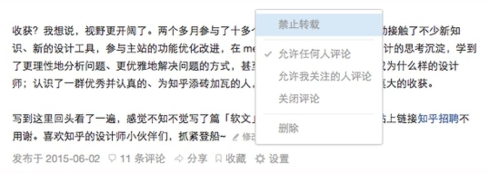
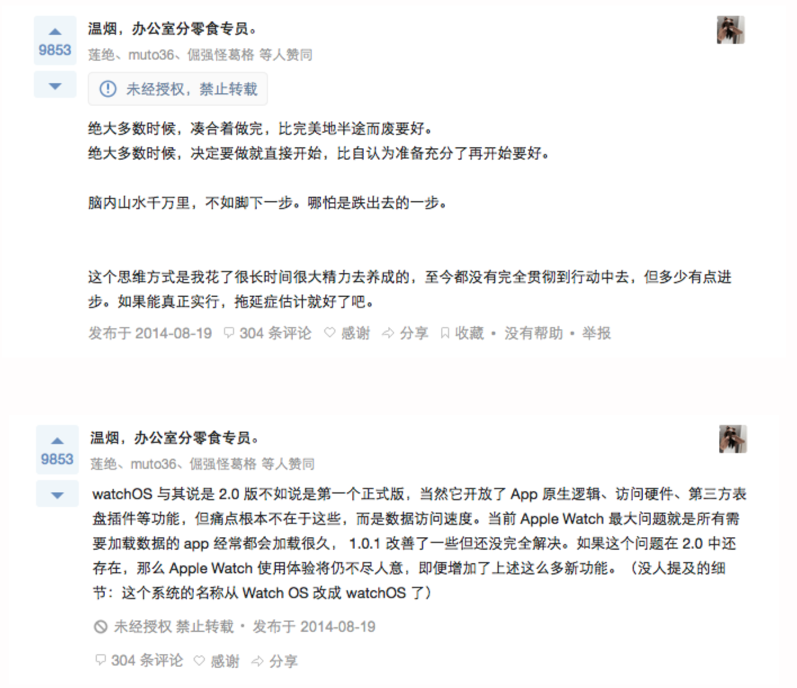
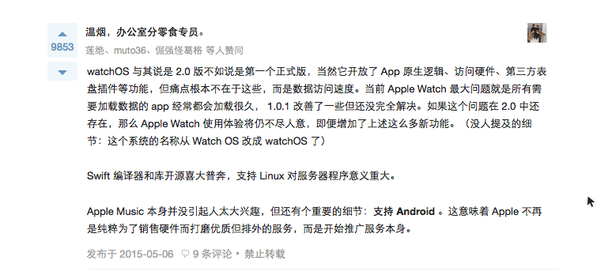
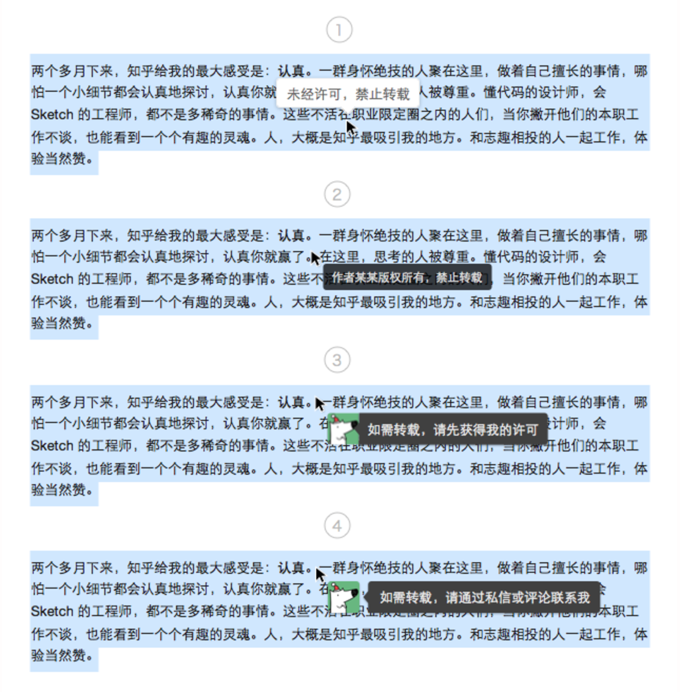
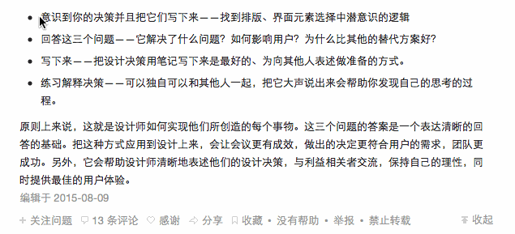
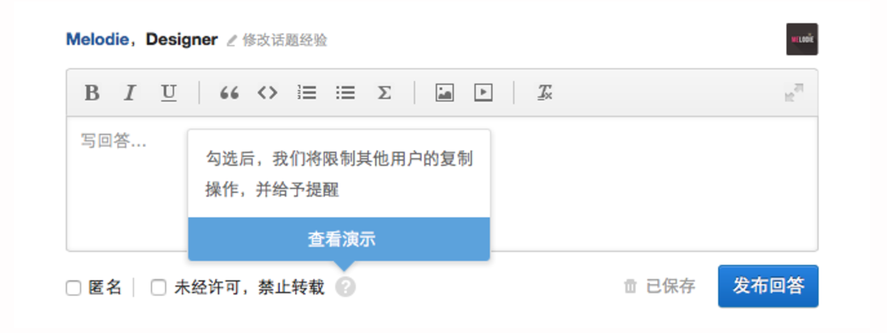
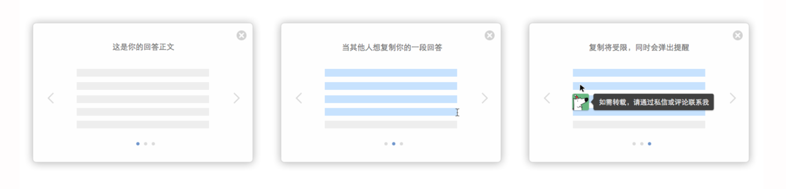
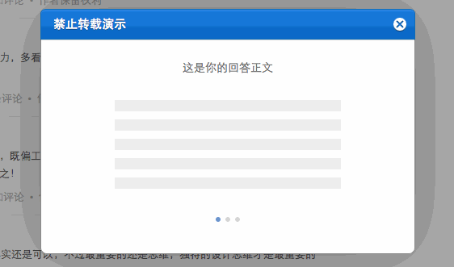

7 月 30 日，知乎 Web 端禁止转载功能上线啦~ 回顾 Web 端「禁止转载」设计和实现历程，可谓一波三折。期间经历了激动人心的脑暴，与工程师的反复讨论和修改，以及不断冒出来的新问题。这篇文章将事无巨细地记录这个过程。

改进前，知乎的「禁止转载」功能，主要存在两个方面的问题：

**1. 展示位置不明显**

在 Feed 中，只有当鼠标 hover 到当前回答上时，回答下方一栏才出现「禁止转载」的文字，并且默认为「作者保留权利」的回答不作版权信息展示。

**2. 禁止转载设置入口较隐蔽**

旧版的禁止转载设置在用户发布的回答下方的「设置」 icon 中，位置藏得较深，很多用户甚至不知道有设置为禁止转载的选项。

「禁止转载」信息展示、设置的不明确，降低了该功能的可用性，直接导致许多用户只能通过在回答中反复强调「本文禁止转载」来维权，我们提供的声明版权的功能几乎形同虚设。因此，为了减少用户的回答里这些并不漂亮的附属信息，让「禁止转载」的声明被合理使用起来，我们做了这样一些尝试。

#### Step 1. 让「禁止转载」展示更明显

最直接的一种改进方案，就是把「禁止转载」变得更显眼一些。当前的每条回答中有这么几个地方可以考虑放置「禁止转载」：头像旁、文首、文末。由于不同的页面头像位置不统一，如搜索结果页就没有展示用户头像，出于一致性的考虑，将版权信息放在头像旁并不合理。考虑放在文首或文末，两种形式的尝试：

#### Step 2. 展示两种状态的版权声明

只展示「禁止转载」，容易给读者造成这样一种误解：没有写「禁止转载」的是不是就可以转载了？因此，我们考虑将「作者保留权利」和「禁止转载」一起展示。作为每条回答下方都必须有的信息，怎样展示对阅读打扰最小，同时又足够明显呢？我们采取了这样一种方案：

现在，我们将版权信息明显地展示在回答底部的信息栏中，避免对用户阅读造成太大的视觉干扰；又由于每条回答下方都有这样一条信息，用户在使用过程中会有预期，知道在特定的地方会有版权声明，这样版权信息的可见性也更好。

#### Step 3. 从转载行为的源头提醒

静态的版权信息展示设计告一段落。然而，反思这种单一形式，存在的弱点是：「文字声明」与「转载行为」之间相对分离，版权声明还是有很大可能被忽视。例如一篇很长的回答，用户在前半部分的阅读过程中就看不见版权声明。于是我们想，是不是可以从转载行为的源头入手，以另一种「动态」的方式给予提醒？

经过某天下午的脑暴，我们讨论出了一个方案，它的干预路径是这样的：某用户选中作者回答部分文字，复制时收到「禁止转载」的提醒，同时无法正常复制文字。

一开始我们就确定了此次设计的目的：从行为的源头开始警醒，而非通过强行禁止进行对抗。因为对于故意侵权的情况，通过技术手段来强行阻止并不是一个好的选择。简单来说，我们只提醒，不对抗。

整个设计过程几乎是层层递进的，主要可分为三个阶段，简要介绍一下：

1. 首先想到的是禁掉右键。为了搜索、查词功能的正常使用，我们设定一个字数上限，超过限制时将无法使用右键，同时会弹出提醒。弹出的提醒样式经历了这些迭代：

2. 如果限制的字数是个固定阈值，用户很快会领悟其中的规律。于是我们想限制字数在一定范围内随机，给复制制造多一些的障碍。字数范围在搜索引擎限制的字数上下浮动，保证搜索功能的正常使用。
3. 进入开发时，前端工程师建议只限制右键中的「复制」而非禁用整个右键。同时，字数范围限制设置得更宽松了一些，大约复制三次可以达到一条微博的长度。

#### Step 4. 设置入口调整和演示动画

之前的「禁止转载」设置入口隐藏在回答后的设置按钮里，入口比较隐蔽。此次在保留原有入口的基础上，将「禁止转载」作为可选项置于回答框下方，作者写回答时就能进行勾选设置。

对于设置禁止转载的内容，还需要特别考虑作者的体验。因为作者可以自由复制自己的回答，会出现作者设置禁止转载时不了解设置后效果的情况。因此，我们为作者设计了一个引导式的演示小动画。用户在写回答第一次勾选「未经许可，禁止转载」时，可选择查看新特性的简要说明和演示动画，有助理解这一机制的运作方式。

最初设计的动画分步脚本：

平台设计需要考虑的问题之一即组件的可复用性。好看虽然是最直觉性的需求，但也需建立在不破坏平台组件秩序的基础之上。秉承这个理念，对演示动画的弹窗样式作了修改，统一成站内登录后的弹窗样式。在与前端工程师反复调整确认后，最终实现效果如下：

#### Step 5. Mobile Web 的实现

工程师在 Mobile Web 端实现复制引导时遇到了一个问题：iOS Safari 的复制选区的半透明蓝色遮罩会覆盖弹出的提示；而在 Android 手机的浏览器中，选择复制后，选区会消失，此时弹出的提示不会被遮盖。为了解决这个问题，我们对弹出提醒的位置做了区别处理：iOS 的弹出提醒位于选区下方，Android 的弹出提醒位于选区中间。

另外，考虑到性能和效果，Mobile Web 端不予展示演示动画。

### 效果

上线一周，设置为禁止转载的回答数量显著增长，据统计，在文中使用「禁止转载」「严禁转载」「谢绝转载」「请勿转载」「拒绝转载」「不要转载」「不得转载」标注的回答比例下降了 16%。上线当天发布的文章[《尊重版权：转载之前请先联系我》](https://zhuanlan.zhihu.com/p/20135322?columnSlug=zhihu-product)，一周内获得 2.5k 赞，用户反馈以正面积极为主。

此次设计在制订方案时，对哪些页面需要禁止复制没有考虑周全，导致在最后测试阶段返工数次。以后在设计前需考虑所有情况，最好能建一个 checklist 作为对照，避免遗漏。
