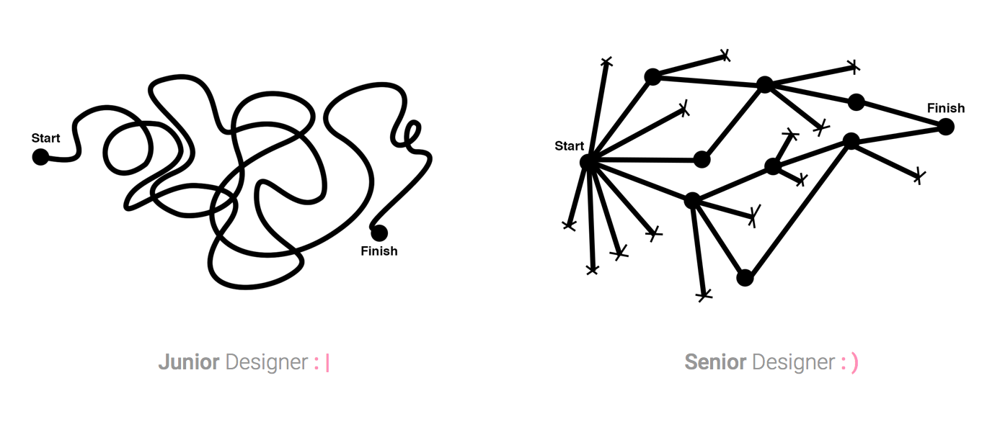

一晃已在知乎实习了半年的设计，六个月的时间不长不短，新鲜劲还没褪去，参与过的项目却也不在少数。回顾这半年，写写我在知乎做设计感受最深的六件小事，也当作是对这段实习时光的一个阶段性小结吧。

### 1. 更「聪明」地解决问题

Julie Zhuo 在 [Junior Designer vs. Senior Designer \*\*](http://link.zhihu.com/?target=https%3A//medium.com/the-year-of-the-looking-glass/junior-designers-vs-senior-designers-fbe483d3b51e)中用两幅图描述了初级和高级设计师解决问题时的一个区别：

初级设计师在遇到问题后，会一股脑尝试想到的所有可能方案，在曲曲折折中到达终点，这个过程有时是混乱且无头绪的。而有经验的设计师遇到问题时思路会很清晰，他们能够将「问题」到「解决方案」之间的路径划分为有条理的 ABC，逐一分析排除，能够花最少的试错代价达到目的。正如《设计的方法》里说的：

> 衡量你是否是一名优秀设计师更好的方式在于——你是否有能力**加速创建过程**，设计出满足客户需要的作品。

人们真正需要的，是设计师从纷繁的复杂中创造秩序的能力。就像知乎在设计职位描述里的一句话：为复杂问题找到简单优雅的解决方案 。

### 2. 先思考，再设计

知乎的「用户界面设计」涵盖了交互和视觉，设计师通常是与 PM 协作产出解决方案，这就要求设计师具备相当的产品理解力和逻辑思考能力，否则很难从整体上把握产品的设计。当了解需求是什么后，设计师要做的事情是透彻的思考：在现有的约束条件下怎样呈现界面才能达到目的。

经历了大大小小复杂程度不一的 Task 后，我有这样一种体会：设计的过程和中学时代解数学物理题的过程很相似。我们在审题（了解需求）后，先根据经验对题目类型做一个预判，然后在草稿纸上边思考边尝试（线稿草图），在演算过程中可能会遇到「此路不通」而「另辟蹊径」，经过反复思考、否定、验证才得到题目的解（设计的解决方案），最后把草稿纸上的思路整理、誊写为试卷纸上的答案（用工具制作的最终设计稿）。

思维方式比工具更重要。在把问题理清之前，不要过早打开软件进行设计。

### 3. 充分沟通、信息同步

设计师这个职位本身的意义就在于「沟通」：抽象意义上的，通过设计可用的界面来实现用户与产品间的沟通；具体工作中，设计师和团队中各种角色打交道，沟通可以说贯穿了整个设计过程。

另外，团队中保持信息同步很重要。比如在设计中有问题及时与 PM 交流，设计基本确定后，尽早让工程师了解情况。再比如大家刚开完一个设计 review 的会，设计师可以主动把会议中的要点整理成备忘邮件，发给参加会议的有关成员，以便后续的工作展开等。

PM、设计师加工程师，这样的组合有些类似阿西莫夫的科幻小说《神们自己》中的理者、情者和抚育者，三者各司其职、充分沟通配合，才能「生出」一个好产品。

### 4. 和挑战自己想法的人共事

设计沉浸久了容易失去客观性，这时设计师除了自己变换角度重新审视作品，更直接的方式是获取他人反馈。在知乎工作，人人都可以提出问题，人人都要做好回答的准备。

在 Web 组，设计稿交付前端工程师后，他们会提许多产品或设计上的问题，我作出解答的过程也正是对自己设计的反刍，用更细粒度的标尺丈量设计细节。有时候，工程师们提出的疑问正是我设计中未考虑周全的，这时我们会一起探讨解决方案，作出设计决策。

和能够挑战自己的想法的人一起工作，会慢慢养成多问自己几遍「为什么这么设计」「这个设计还能不能更好」的习惯，推敲每个设计细节，因为只有自己想清楚了才说得出令人信服的理由。

### 5. Thinking Outside the Box

在一个产品趋向成熟的团队中，设计师们所做的大多数工作是从 1 到 2、到 3…到 N 的改进式设计，这种不停迭代的产品设计过程需要在较长的时间线上才能看出它的意义和效果，它是日常的、修复性的和冷静的，有时甚至是「无趣」的。但其实，是否有趣关键在于我们以怎样的态度来看待，如果能多想一点，跳出现有的思维框架，就有可能创造出从 0 到 1 的设计，这个过程是充满趣味和惊喜的。

### 6. 关心设计效果和反馈

产出设计稿不是设计的终点。开发过程中设计师也要时刻保持敏捷，比如跟进工程师以最大程度还原设计稿、理解技术局限作出平衡决策、快速反应实现阶段发现的设计缺陷等。

开发结束，上线后用户反馈怎么样？数据指标有了什么变化？产生的效果是否达到了目的？接下来还要怎么做？这些都属于设计后的验证、跟进阶段。关注产品设计的效果不仅是 PM 的职责，设计师也要主动去了解，为自己的设计承担起责任。

设计过程永远不会真的结束，技术、用户、预期和需求总是在不断改变，这就需要设计师保持敏锐的观察力、并持续思考。

分享这六件关于设计的小事，希望能对同样刚从校园走出来的设计师们有一点帮助。以近期最喜欢的文章里的一句话结尾：

> For me, trying to be a better designer means trying to be a better human being, as cheesy as it sounds.
> — [The Day You Became A Better Designer](https://medium.com/desk-of-van-schneider/the-day-you-became-a-better-designer-68ee48e1c34c)
