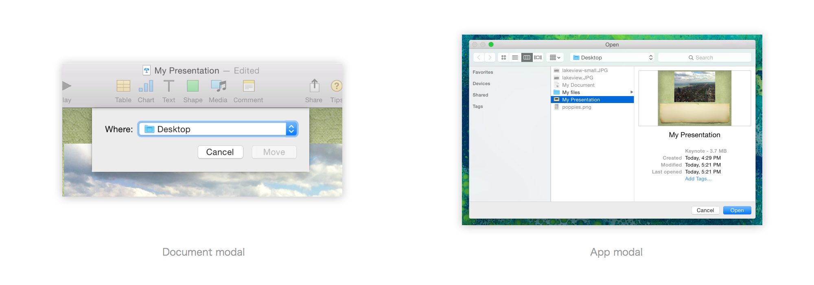

**模态对话框/弹框（Modal Dialogue Box）是什么？**

模态对话框强制要求用户回应，否则用户不能再继续进行操作，直到与该对话框完成交互。

**什么时候会有拖动模态弹框的需求？**

由于模态弹框出现后，就无法操作弹框以外的区域，因此拖动弹框的需求只会是：

> **在与弹框交互的同时，需要拖动弹框查看底部被遮挡的界面内容。**

因此，我的理解是：

**A. 如果没有以上需求，则不需考虑拖动**

让用户专心于弹框中的任务，此时最好能将此对话框设计成看起来就不可拖动。如：

**B. 如果有以上需求，则必须让弹框可拖动**
由于用户有需求，所以会很自然地尝试去拖动，此时设计只需要给予适当的隐喻（顶部有 titlebar，鼠标移到顶部光标变化等），即可达到目的。

有趣的是，[Apple 在 OS X Human Interface Guidelines: Dialogs](https://developer.apple.com/library/content/documentation/UserExperience/Conceptual/OSXHIGuidelines/WindowDialogs.html#//apple_ref/doc/uid/20000957-CH43-SW1) 一章中讲到系统级对话框，其中的模态对话框 Document modal 和 App modal，刚好对应了「不可拖动」和「可拖动」两种情形：

另外，由于弹框的打扰性很强，在实际做设计时，最好先想清楚：是否只能用弹框的形式？然后再考虑：设计什么样的弹框能更好地满足这个设计目的？需要考虑的因素包括弹框样式、底部是否有遮罩、能否被拖动、弹框大小，弹框位置等等。

---

**附：问题背景和自我推翻**

这个问题提出的背景是我们一坨人的一次午饭讨论，大家各有各的看法，但总体基本倾向于「模态弹框应该可以拖动」，持该观点的人包括我，当时我所深信不疑的几个理由包括：

1. 因为弹框浮动在下方的内容之上，看起来应该是可以拖拽移动的。
2. 用户受系统级窗口的交互习惯影响，认为有顶栏的就可以被拖动，因此看到有顶栏的模态对话框，会有类比心态。
3. 拖动虽然没什么用处，加上后觉得不能拖的不会去拖，没有什么损失；但那些觉得可以拖的人，拖动了，就会很爽。

然而过后头脑冷静下来想一想，发现这些理由并不可靠。理由 1 和 2 均是建立在「一个有顶栏、浮起的、看起来可以拖动的模态弹框」的形式之上的推断。反过来想，如果一个弹框被设计成另一种看起来就不可拖拽的形式，是不是用户就应该认为它不可拖拽了呢？即形式决定了预期。对于理由 3，用户为什么会需要一个没什么用处的功能？（在设计了符合预期的样式下）依然认为这个对话框可以拖动的人，如果发现拖动不了，会产生很严重的后果吗？还是只是少数几个人心理上接受不了的问题？

推翻后回到问题原点，写了[这篇回答](https://www.zhihu.com/question/36483374/answer/68456544)，欢迎探讨。
