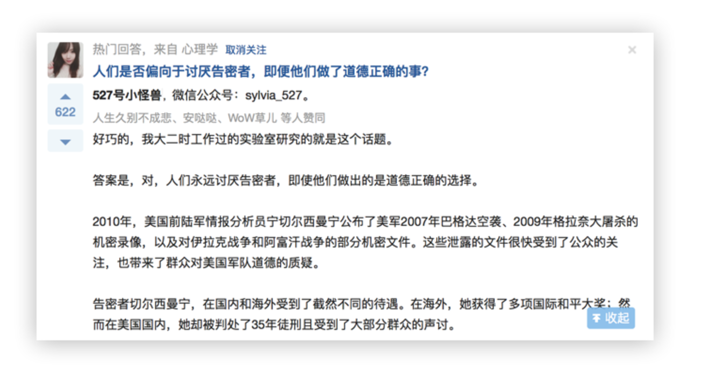

#### 背景

知乎的长回答作为优质内容的主力军，分布于知乎的各大页面板块。然而，回答很长，但屏幕有限，对阅读者来讲，这就产生了一系列的问题：

1. 在看长回答的过程中，如果看到一半不想看了，很难对其进行中止阅读的操作；
2. 一旦开始卷动页面阅读，就很难返回查看回答顶部的信息或进行底部的评论、分享等操作；
3. 首页等 Feed 无法在展开回答后随时收起。

为了改善 Web 端长回答的阅读体验，我们对「收起」按钮进行了重设计，范围涉及所有有回答展示的页面。

#### 解决方案

两套逻辑说明：

1. **首页、搜索结果页、圆桌页、发现页、个人页、回答页中的「更多回答」**：回答默认缩略，只要点击「显示全部」，就出现「收起」按钮；如果回答底部在视窗外，「收起」按钮悬浮。当滚动到当前回答底部时，「收起」按钮不再悬浮，跟随该回答一起滚动。
2. **问题页、回答页**：回答默认全部展开，当 {回答内容部分高度 : 当前视窗高度 > 1}，滚动时出现「收起」悬浮按钮。当滚动到当前回答底部时，「收起」按钮消失。

#### 设计时遇到的坑

**1. 在屏幕较窄的情况下，悬浮的「收起」按钮来到回答底部后没有地方落脚了**

原因：底部操作和信息太多，底栏已不可扩展。

备选方案：只在鼠标 hover 在文本内容上时出现「收起」，其余时候都不显示「收起」。

存在的问题：实现出来的试用体验并不好，「收起」的出现和消失不太符合用户心里预期。最终方案：保留原先的设计逻辑，在回答页、个人页等底栏已满的页面，滚动到回答底部时，「收起」按钮消失。（底部信息、操作过多的问题已在解决中，所以只是暂时的权宜之计）。

**2. 移动 Web 的实现效果不佳**

触摸设备的滚动监控的是手指离开页面的时刻，这就可能导致「收起」出现的时刻会有延迟，使用起来会觉得「卡顿」。

解决办法：考虑到在移动 Web 端进行长时间阅读的情况并不多，暂时移动端不做「收起」。

我认为移动 Web 的设计思路应该更像 App，通过优化结构来改善这一问题。沿袭 PC Web 的内容呈现形式并不适用于移动端的使用场景。

**3. 收起后的定位到底应该定到哪里？**

点击收起按钮后，页面内容应该怎样变化才是符合预期的？前后我们试过两种形式：

1. 被收起的回答将被固定于视窗顶部

2. 收起后恢复到用户点击展开前的样子

两种方案存在的问题都是情景考虑不完整。展开一个回答后，随着页面滚动，回答在视窗内的展示有三种状态，因此需要对每种状态进行分别设计，逻辑如下：

- 当长回答的头部在视窗内时，收起时头部固定不动，回答向上收起；
- 当视窗中看不见回答的头部和尾部时，收起后该条回答固定于视窗顶部；
- 当长回答的尾部在视窗内时，收起时尾部固定不动，回答向下收起。

#### 反思

长回答收起功能于 2015 年 11 月 4 日上线，从数量上看，在底部收起回答的次数比在阅读过程中收起的多一些。看起来，用户对「随时收起」的需求并没有他们想象中那么强烈。个人猜测，不少人「收起」长回答可能不是因为想在阅读时中止，而是有展开阅读完后收起还原（不排除是旧版的设计——只有底部的收起——让用户养成了这样的习惯）。

从上线后的用户讨论来看，反馈基本都是正面的。「收起」按钮算得上是个千呼万唤始出来的 feature，作为设计者，除了听到用户大喊快哉产生的满足感，静下来反思时还是有些疑惑。「收起」究竟是为怎样的场景而存在？是什么原因造成非得需要一个「收起」才能好好刷知乎？有没有可能从优化信息结构的角度出发，从源头解决根本的问题？需要思考的还有很多…
