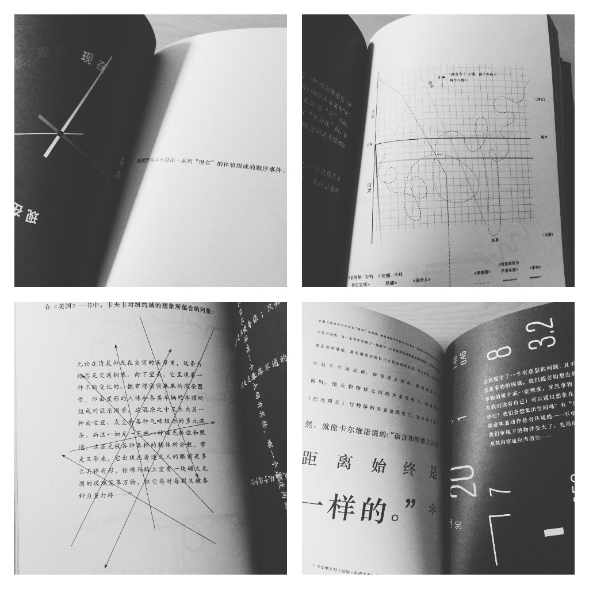
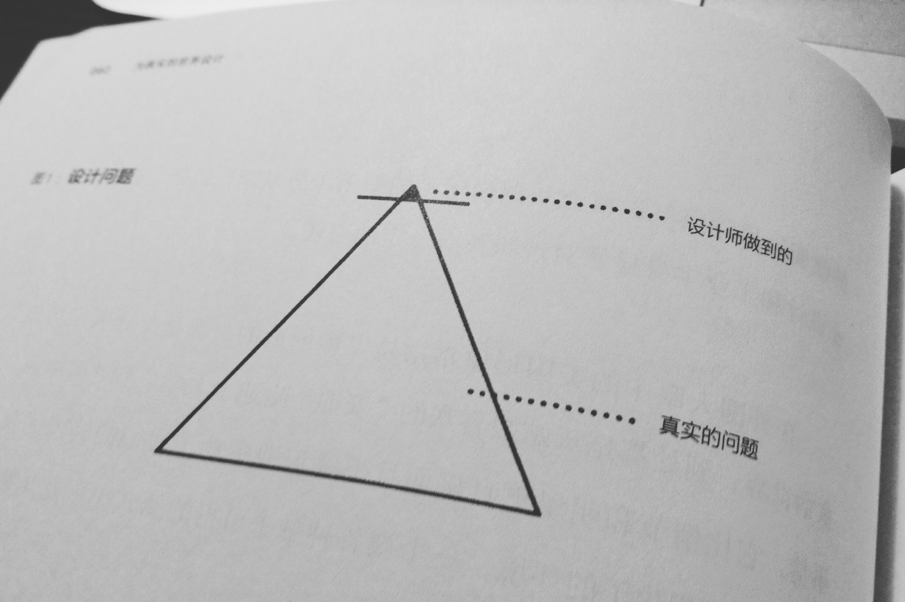
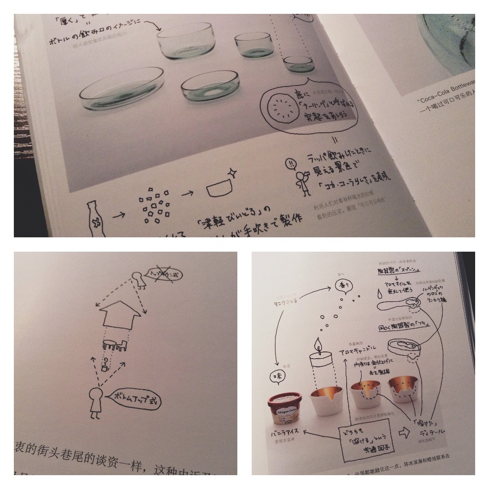

#### 1. 来自一个有趣老太太的絮叨

**《我的脖子让我很不爽》**

作者诺拉·艾芙隆。读这本书的感觉像是一位特别顽皮的骨灰级文艺老奶奶在和你推心置腹，看到共鸣处会心大笑，读完了会不由得很想认识这个有趣又睿智的女性（令人惋惜的是老太太在 2012 年因白血病去世了）。但愿我们头发花白的时候也能如此潇洒又偏执地絮叨调侃。喔，对了，她年轻时还是《西雅图不眠夜》《当哈利遇到莎莉》等电影的编剧和导演。

> 我的皮肤医生说，脖子是从 43 岁开始走形的，就是这样喽。脸可以涂化妆品，眼睛下面可以涂遮瑕霜，头发可以染，皮肤松弛可以注射胶原蛋白、肉毒杆菌以及玻尿酸。但如果不动手术的话，你只能对着该死的脖子干瞪眼。脖子是百分之百的泄密者。我们的面孔写满了谎言，但脖子却寸寸真理。你得把红杉砍了才能知道它的年龄，如果它有脖子，就没这么麻烦了。

#### 2. 关于阅读的「通感」

**《当我们阅读时，我们看到了什么》**

作者是彼得·门德尔桑德，顶有名的书籍装帧设计师。你在阅读一段描写时脑中同时发生了什么？你能根据描述精确想象出人物的头发、眼睛、鼻子都是什么样的吗？叙事的走向与我们的情绪起了什么反应？彼得把这个过程中微妙的心理感觉还原成了可视的图像语言，相当奇妙的阅读体验。

#### 3. 造物之美

**《迷人的材料》**

作者马克·米奥多尼克，「浪漫的」材料科学教授。作为一本科普读物，它可能是过分有趣了。最爱「纸」和「巧克力」两章。合上书再环顾四周，仿佛每个物件都藏着故事。

> 制作巧克力所需的技术之复杂与高明，绝对不下于钢铁和混凝土。人类凭着惊人的天才，把这个平淡无奇、味道令人作呕的热带果实，变成冰冷、坚硬而易碎的固体，就为了让它达成一件事：熔于口中，用温暖、芬芳、苦中带甜的滋味填满我们的口腔，活化大脑的快乐中枢… 我觉得巧克力就像一首诗，跟十四行诗一样复杂与美好。这就是为什么古希腊人会称它为 theobroma，因为巧克力确实恰如其名， theobroma 的意思就是「神吃的食物」。

#### 4. 设计的理论与良知

**《为真实的世界设计》**

作者维克多·帕帕奈克，生前为许多第三世界国家做大量的设计工作。什么是设计？为谁设计？怎样设计？设计的教育应该是什么样的？设计师应该解决什么问题？书里有明晰而警醒的答案。我不认为这本书里所讲的只停留在某种「理想」，如果设计者们对自身的角色有更深的思考，现实可能就会向理想倾斜一些：总之，Do the right things。

> 如果我们把上述所有的少数人聚在一起，如果我们把所有这些「特殊」的需要合起来，我们会发现，我们竟然已经是在为大多数人设计了。只有 20 世纪 80 年代那些为了好玩而变换样式的工业设计师，那些为了一小撮富人市场而殚精竭虑的人，他们才真正是在为少数人设计…… 鉴于我在上文中涉及那么多领域，有人可能会认为我觉得世界上的问题都可以通过设计解决。真理往前走一步就是谬误。我所说的是，很多问题都会因为设计才能的于预而变得简单一些。对于设计师来说，这意味着一种新的角色，他不再是企业掌握的工具，而成为使用者的支持者。

#### 5. 朴素的设计方法

**《设计的方法》**

作者 Eric Karjaluoto。说它是朴素的设计方法指南一点没错，Eric 是「设计功能化」的信奉者，他认为设计的关键在于目标的实现，而精美的设计作品集如同纪念品一般，或许可以证明设计师的付出，或许甚至可以因为它们变得出名，但这些并不是职业生涯中的最重要部分。印象最深的是书中对设计工作秩序的追求、以及对设计本身的坚守。2015 上半年影响我最大的一本书，四月份的时候写过[一篇读书笔记](http://melodiezhang.com/post/wo-men-suo-xu-yao-de-she-ji-fang-fa-he-qi-ta)。

> 不断地磨练你的技艺。最后，这种练习需要不断循环的作用、细化并重复。不要想着完美、噱头或者你的同事在做什么。专注于你的客户、你的技能技巧，还有对精通的追求。这种谦逊的观点会帮助你拿出更好的设计，让你充满自豪和满足，这些不是俗气的奖品和奖杯能给你的。

#### 6. 科学入门读物

**《这才是心理学》**

作者基思·斯坦诺维奇。精炼好看的心理学入门读物，把科学里的基础概念讲得清晰透彻，全书没有一句多余的话。经典之作，无需赘述。

#### 7. Nendo 的设计理念

**《由内向外看世界》**

几乎算是一本 nendo 工作室的作品集，讲述了佐藤大怎样从日常生活里创造出精妙的设计。书中佐藤大的手绘插画很有趣，展现了当他看到一件物品，是如何思考、衍生的。收获了一些看待事物的新视角。「所谓设计，就是让这个世界上人与物之间、人与人之间、这种情况和那种情况之间，都能用更加合适的形式连接起来的思考和行动。」

> 佐藤的这些观点，跟普通的设计师们想的完全不一样，或者根本就是背道而驰的。比如：
>
> 1. 享受平淡无奇的每一天；
> 2. 不要努力寻找创意/不要使用什么技巧；
> 3. 不要将目光局限在某件事物上。

以上是这一年印象最深、对我影响最大的七本。

2015 年里读过的书比 2014 年的少了几本。如今又开始买纸质书了。希望一直读下去。
