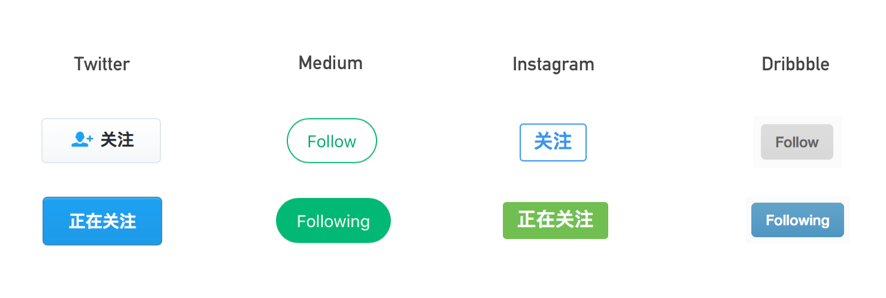
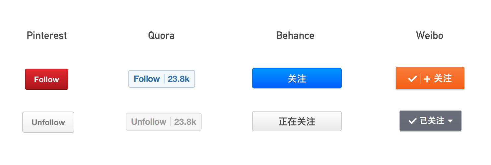

做设计时发现一个有趣的现象，众多社交产品中，关注按钮点击前后的样式，存在两种截然相反的处理方式。一种做法视觉上强调关注后的正在关注状态：

另一种做法却更强调关注前的关注行为：

两种方式代表了两个思路，各有利弊。第一种在没有关注用户时，按钮的视觉样式不过分突显，在譬如推荐用户列表的地方，适用性较强；缺点在于关注按钮的可发现性较差，可能对关注率有一定影响。第二种方式刚好相反，对关注行为强引导，视觉突出，但有时在页面适用性上会存在一些局限，尤其是在列表中的表现。

产品设计者当然希望用户之间更多地建立社交关系，对关注按钮的视觉强化看似是理所当然的。那为什么像 Medium、Instagram 这样的社交产品，没有把关注按钮设计得更加明显，反而是强调关注后的状态？

发了封私信给 Medium 的前设计总监 [Dustin Senos](http://dustinsenos.com/)，问了这个问题：当初设计 Medium 时为什么 Follow 使用了 ghost button，而 Following 用 solid button？为什么不是反过来的？这个决策和数据有关吗？

意外地收到了 Dustin 的回复：

> It's a great question, and I'm not sure there's one correct answer. I believe we sometimes use ghost buttons to indicate something that has not been clicked on yet, so that when you do click on it, you "fill it up" and it looks active. I also imagine if you were quickly scrolling through a list of people and you saw a button filled in solid, you would feel like you're following that user as that row now has more visual weight—that is probably based on my experience with the button styles we use.
>
> I'm not sure on the data, but I would guess people would be more likely to click on solid buttons, as they're heavier on a screen, but I'm not sure if it would correctly match with their mental model.

大致意思是：

「这是个很棒的问题，我也不确定是否有一个正确答案。我认为我们有时会用 ghost button 来暗示没有被按下的东西，所以当你按下时，你「填充」了它，它看起来是被激活的。假设你快速地滚动一个用户列表，看到一个被填充的实心按钮，你会意识到你正在关注这个用户，因为那一行的视觉更突出——这一点可能是基于我们使用的按钮样式的经验。

虽然我不确定数据是怎么样的，但我猜想人们更有可能去点击实心按钮，因为实心按钮在屏幕上更显眼，但我不确定这种做法是否与人们的心理模型相符。」

心理模型的角度是我之前没有想到的。「点亮」是正向操作，「熄灭」是负向的。当你在冗长的用户列表中看到亮起的「正在关注」时，你会觉得这个人与你有关。这样想来确实不无道理。假设反过来，用显眼的亮色吸引人们去点击关注按钮，站在功能性的角度，好像也没有什么问题，数据还可能会更好看，可这是否与人们的思维模式相契合呢？

还有不可忽视的一点是，关注按钮也是按钮的一种，在系统级的语境中，一个产品中**同类按钮**的行为不应该是互相矛盾的。Instagram 的 Like、Follow 这类存在两种正反状态的按钮，都采用了同一种模型，用户能在一致的体验里形成自然的反射回路。尤其在较复杂的 Web 产品中，同一页面上分布着不同功能的按钮，哪种设计方式更能简化用户的识别和决策过程，哪种方式就是更优的。

如果你也在思考按钮的设计，或许能从中得到些不一样的思路。
