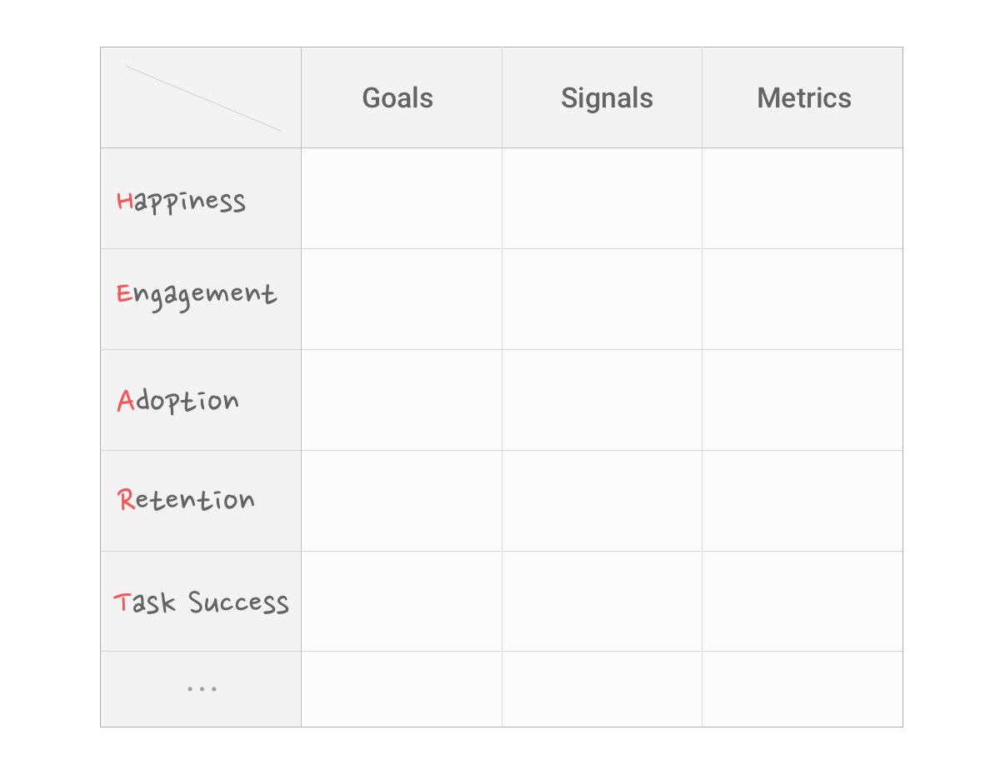

大多数设计行为是为了解决问题。怎么判断问题是否被解决了、解决得好不好？如果你的设计产生的影响是可被量化的，那么有一种相对客观的评价方式是：看数据。

### 怎样制订数据指标

如何有效利用数据验证设计，是一直以来困扰我的一个问题，我的主要疑惑在于：

- 在设计前，如何知道需要监测哪些数据来辅助验证设计效果？
- 到底怎样通过数据来判断一个设计是好是坏？

Google 用户体验研究员 [Kerry Rodden 的一篇文章](https://library.gv.com/how-to-choose-the-right-ux-metrics-for-your-product-5f46359ab5be)给了我很大启发。在 Google，数据指标通过「用户体验质量」和「产品目标」两步来确定。「用户体验质量」简单来说即「你想要观测设计的哪些方面的效果」，「产品目标」则是基于你想要观测的这些方面，按照「目标 → 标志 → 指标」的顺序确定数据指标。根据这种方法来制订数据指标，思路清晰明了，总体过程会是这样一个矩阵：

表格左列代表着待考量的用户体验质量维度，Kerry 称之为「HEART 框架」，在实际运用中无需完全遵守，可根据项目需要有所侧重或增减。

表格横向的三个词语值得解释一下：

#### 目标（Goal）

简单说就是，你希望设计上线后，在哪个方面达到什么样的结果。比如 Youtube 的搜索功能，在 Task Success 方面的关键目标是：用户搜索时更快速地找到最相关的视频或频道。

#### 标志（Signal）

目标确定了，那什么信号标志着设计达到了或没达到目标呢？比如 Youtube 在 Engagement 方面的标志就是：用户在 Youtube 看视频的数量和所花费的时间。又比如搜索功能在 Task Success 方面失败的标志是：用户搜索后没有点击任何搜索结果。

能判断是否达到目标的标志可能有很多，这时候要结合实际情况取舍。比如这种标志追踪起来方便吗？它能随你的设计变动而观察到明显的变化吗？

#### 指标（Metric）

指标比标志更加落地，它很接近我们获取到的原始数据。例如，「用户在 Youtube 上看视频的时间」这一标志用指标来体现就是「每日人均看视频分钟数」。

通过「目标 → 标志 → 指标」流程，结合 HEART 框架，就能清楚地知道要验证设计的哪些方面，需要关注哪些数据来达到目的。

### 两个启发式例子

#### 被误读的数据实验

2010 年一位澳大利亚的设计师打算做两件事：一是写一本书，二是重新设计他的个人网站。设计网站时他想实践一把用数据指导设计决策，于是做了个 AB 测试。A 方案在网页上非常详细地介绍了将要写的这本书，然后留了一个可填写邮箱的地方；B 方案没有任何关于书的介绍，只写了「如果你是设计师，你应该对这本书感兴趣。填写你的邮箱」。

测试结果出人意料，A 方案只收获了 33 个邮箱地址，而没有任何介绍性内容的 B 方案却收获了 77 个邮箱地址。于是这位设计师又惊又喜地写了一篇博客，描述了他的实验过程，并感叹数据总能让我们惊讶，甚至能告诉我们与经验相反的东西。

可是，从这个实验结果可以推断出 B 方案更好吗？

看起来这位设计师衡量成功的标准是「收到更多邮箱地址」而不是「能卖出多少本书」。假如以销售量为标准，现阶段的数据是无法得到「B 方案比 A 方案更好」的结论的，因为你不知道未来给这两拨人发推销邮件时，哪一拨的购买率更高。

这个数据实验是不完整的。如果搞错了目标，再精确的数据统计也只能得到误导性的结论。

#### Medium 的衡量指标

当我们在谈论一家公司或一个产品是否够「大」时，基本是基于单一的数字，比如过去一个月的使用者数量，但我们很少细究到底什么是「使用」，这难道不奇怪么。

和那些盲目喊着要扩大用户数和规模的产品不一样，对 Medium 来说，有人在真正花时间阅读，才是一件意义重大的事情。因此它更关注人们的阅读时间而非访客数量或浏览量，通过衡量时间成本，它反映的是产品带给用户的价值。如果 UV 很高，但用户在网站上平均停留时间很少，几乎没有读什么东西，那么 Medium 并不觉得这是一件值得高兴的事。

KPI 式的价值观常常给人带来误区：数字即规模，规模就是一切。但我们可以看到，许多产品因用户数量的骤增曾备受瞩目，但最后大多以失败告终。就像 [Ev Williams](https://medium.com/@ev) 说的，也许有时候，我们应该更加关注所创造事物的深度而非广度。数字很重要，用户数也很重要，但相比这些，我们更应该想清楚对于一个产品来说核心价值是什么、究竟什么才是最重要的。

### 不万能的数据

数据不是万能的。它就像问卷调查、用户访谈等任何用户体验研究方法一样有着其局限性。比方说：数据无法告诉你「为什么」，你需要结合其他的手段或方法来弄明白表象背后的东西。

Facebook 有一个功能可以让用户举报垃圾信息或滥用的照片，但他们统计发现，被举报的照片中只有很小一部分违反了社区规范，大多数是人们在派对上拍的照片，并且大部分举报照片的案例都是用户要求删除有他们自己的照片（因为派对上被拍到的照片通常比较囧，人们并不愿意被展示出来）。基于这个发现，Facebook 加了一项新功能：遇到类似情况时引导用户发消息给他们的朋友，要求删除照片。然而数据显示只有 20% 的人给朋友发了消息。进一步的研究发现，如果在提出删除要求的同时，也让朋友了解到被上传照片的人的心情，结果就会有所不同。改善后的功能在界面上的呈现是这样的：

加入了对被上传照片者心情的描述后，大约 60% 的人会去发消息，而且后续反馈表明，参与对话的双方都感觉良好。在这个过程中，设计师用了很多数据来支持他们的决定；但是，数据不会代替设计的直觉，更不会代替深入的研究、测试、同理心。

数据只能告诉你 What，却不能告诉你 Why。分享了这个案例的 [Margret Gould Stewart](http://link.zhihu.com/?target=https%3A//medium.com/%40mags) 说的一句话令人印象深刻：

> Data can only make a good design great, but can never make a bad design good.

### 总结

数据在设计中的重要性不言而喻，它让设计师对产品对用户有更宏观的认知，能让我们拿出更客观的理由证明自己的设计为什么好。

如果你不清楚怎样制订数据指标，Google 的这套方法或许对你有用。按照「目标 → 标志 → 指标」的原则，结合 HEART 框架，就能确定应该验证设计的哪些方面，要关注哪些具体数据。

提防数据中的陷阱，有时候它会把我们带偏，要小心区分「观察到的现象」和「推断出的结论」。从这个角度来说，设计其实也是一门非常需要 Critical Thinking 的学科。另外，不管任何时候，数据都不应该是根本目的。要想清楚你的产品核心目标和价值究竟是什么，否则容易把力气使错地方。

最后，数据作为一种辅助设计的手段，也有它的局限性。它能告诉你发生了什么，却不会开口向你解释为什么会发生，设计师需要结合其他手段找到问题所在。
