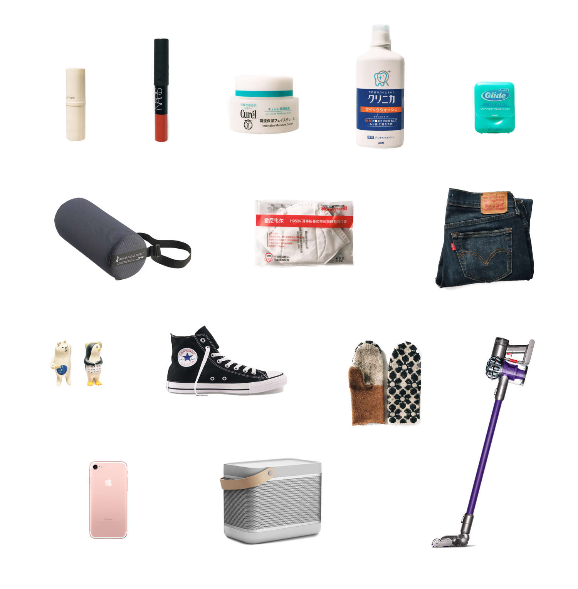

### 书

今年看的书比起去年来轻松许多，阅读习惯也从电子书慢慢向纸质书倾斜。我喜欢任何一种阅读媒介，但最近偏爱捧起实体书的亲密仪式感，那是种能给予人慰藉的踏实。

**食贴 09：了不起的面包** 关于面包的好奇心启蒙读物，它让我第一次意识到面包也是有生命的。等到夏天的时候，赋闲良久的烤箱终于又可开始新的实验。

**佐藤大：用设计解决问题** 是佐藤大的第二本书。一直非常喜欢 Nendo 工作室的设计理念，give you a "!" Moment。

**大萝卜和难挑的鳄梨** 村上君太有意思。生活多有趣唷。

**东京本屋** 因为打算年底去日本，找来这本采访和描写东京书屋的书，没想到给了我另外一些启发。书里有张 COW BOOKS 书店的结账小票做成的书签，发现的那刻真是惊喜。

**社会心理学** 觊觎已久，厚厚一本买回来称心无比，是那种可以随便翻开一页就能读得乐趣无穷的大部头。

**用户体验的要素** 用户体验设计经典框架。

**七堂极简物理课** 宇宙的神秘与秩序令人感动。时间流逝可能只是混沌的幻觉，空间是弯曲的，如一个移动中的巨大软体动物。浩瀚宇宙中我们的灵魂也许只是一个小小的样本。

**学徒面包师** 教科书级别的面包烘焙指南，跟着书里尝试做了两根波兰酵头发酵的法棍。

**最好的告别** 让我重新认识了有关死亡和生命尊严的关系，这是每个人都必须直面的课题。

> 成为一个人的战斗就是保持生命完整性的战斗——避免被削减、被消散、被征服，避免使现在的自己与过去的自己和将来想要成为的自己相断裂。通过改变每个人生命最后阶段的可能性这一方式，我们有机会重塑我们的养老机构、我们的文化和我们的对话。

### 影

习惯在豆瓣记录看过的书影音，特意去翻看了下，迄今为止一共看了 600 部电影/剧。而 2016 年积累了四五十部，打动人心的当然也不只列出来的这些。近来越来越觉得，电影是否好看，和你当时的心境，你和什么人一起看的，都有着密切的干系。

**请回答 1988** 今年最佳。一部适合和爱的人一起看的剧，真实、有趣、又可爱又感动。

**海街日记** 年初年末看过两次，羡慕四姐妹的生活状态。镰仓真美。

**朱莉和朱莉娅** Nora Ephron 是我最爱的女性导演，佐以美食题材的真实故事，这部电影让人欲罢不能。Julia 在电视节目上边为火鸡开膛边说做饭没必要那么一本正经，失败了再来不就好了，又没有人会看到，多可爱。Bon Appétit！

**母亲** 朴实战争年代的故事，从寻常日本家庭的视角反映了导演对战争的态度。看了也落泪了，到了结局却有些怅然。

**西部世界** 我更倾向认为这是部话题性大于剧情本身的剧，它呈现出了看剧的另一种可能，即观者通过谈论猜测参与进来，这些节外生枝的剧情猜想让故事本身增添了丰富性和吸引力。虽然整个故事的设定令人惶恐，但结局还是让人有了丁点慰藉。

**比利林恩的中场战事** 看 24 帧时感受的是完全沉浸式的故事，现在都还记得当时看完后的复杂和激动；而 120 帧超现实的清晰把情绪暴露无遗，这种致命的临场感直接导致了在看到演员红着眼眶时无端地被感染落泪——并非理解式的结果，而是种本能反应。很喜欢新技术，也非常喜欢这个故事，谢谢李安。

**寻找薇薇安迈尔** 谜一样的人。看过之后对摄影这件事有了新的感触。

**最佳出价** 一个可以完全沉浸其中却绝对猜不到结局的故事。

### 音

工作时除非环境太嘈杂，否则也不大乐意耳机里有音乐响起。听歌变成了更纯粹的听歌，就比如晚上在家打开蓝牙音箱，什么也不做，只听歌。然而今年也并未刻意去发现好音乐，听来听去还是那些旧的、熟悉的声音。

**珞樱 2** 母校的原创音乐社团两三年前的专辑。今年毕业时拿出来听，边听边浏览着网易云音乐下方大家的评论留言，很让人动容。

**1701** 李志的歌大概可以听一千遍吧。

**飞船，宇航员** 记得听《寡妇王二嬢》，开始只是笑，后来了解故事背景后却哭了。还有单曲循环最久的《龙港秘密》，听完一遍仿佛做了一个长梦。

**李宗盛：理性与感性音乐会** 老歌的秘密就是在瞬间抓住你的耳朵。很少听演唱会记录型的专辑，这一张却很对味。

### 物

这一年买了不少东西，好的坏的都有。有时候真是深切地感受到，你被你所拥有的东西塑造着。趁手的物品让你心动，并能够与你相伴很久。

**润唇膏** 回购过三次，设计简单好用，膏体是淡淡的蜂蜜味。

**Nars Dolce Vita** 经典裸色，虽然不化妆，涂过薄薄一层后整个人会看起来更有精神。铅笔头式的设计没有庸常口红的那种距离感，刚刚好。

**Curel 系列** 敏感干燥肌秋冬护肤必备，尤其是在北京。

**漱口水** 今年偶然发现了狮王的漱口水，包装和味道都是心头好，也不刺激。

**牙线** 养成了每天晚上用牙线的习惯，这款 Oral-B 用起来相当趁手，尽管薄荷香味这个 feature 实在没什么用。

**McKenzie Lumbar Roll** 看完《麦肯基疗法》在美亚上买了两个，办公椅上绑一个支撑腰部，纠正驼背和脖子前倾的坏习惯。

**Honeywell H950V** 北京雾霾天必备，比起 3M 较小众，无异味不勒脸，但是气密性稍微差那么一丁点。

**Levi's Boyfriend** 从夏天穿到冬天，裤脚挽起来版型非常好看，百搭。记得当时买的时候还嫌贵，现在看起来简直是年度最值。

**Decole 小摆件** 日本制造的桌面小摆件，造型超萌，有一股诙谐的闲适感，还可以配套各种生活场景购买，买了一堆放在办公桌上，偶尔瞄到一眼就很开心。

**Converse 高帮黑色** 同样是能从夏天陪伴我到冬天的经典款。穿坏了就会买，前前后后大概陪伴我有五六个年头了。

**羊毛手套** 今年冬天最爱的物品，款式、花纹和厚薄都恰合心意。

**iPhone 7** 就是喜欢粉色啊。

**B&O Beolit 15** 简约好用，音乐经过它的调味好像变得更好听了耶。

**Dyson 吸尘器** 虽然面对长头发它一点办法也没有，但有它帮忙还是提高了做家务的效率。

---

这一年，多谢陪伴 : )

2017 也请多多关照呀。
