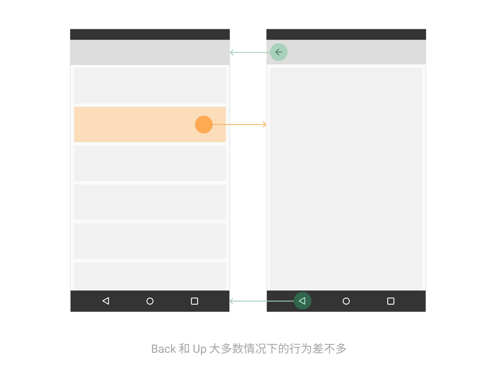
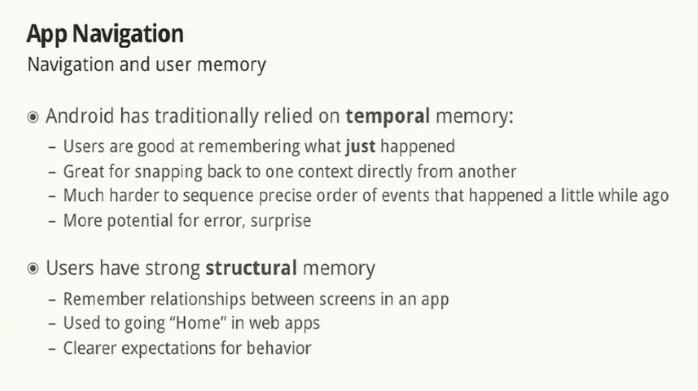
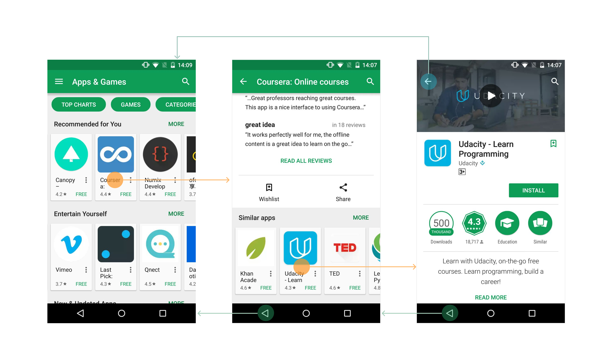
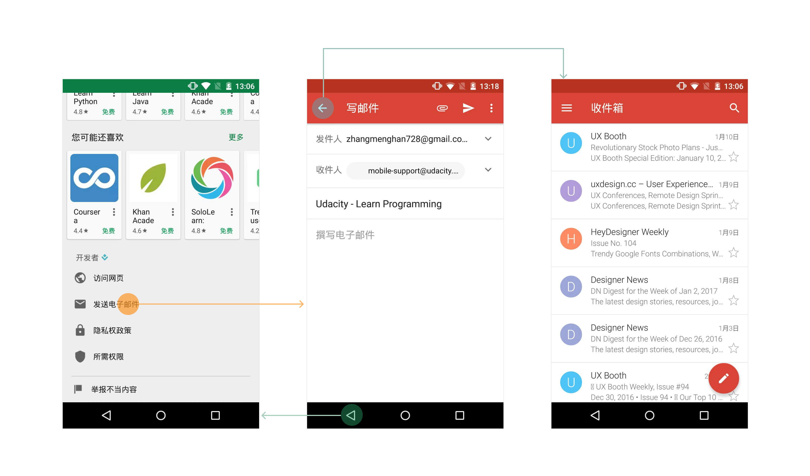
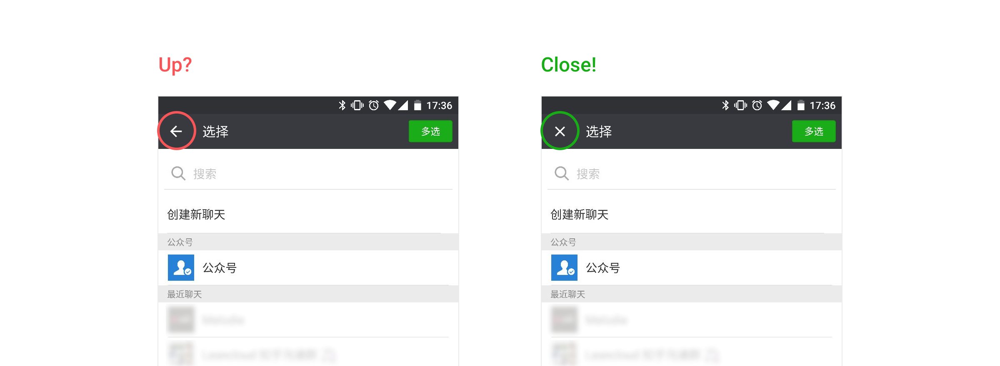

熟悉移动设计的人大概知道 Android 系统有两种导航方式 [Back 和 Up](https://developer.android.com/design/patterns/navigation.html)。

- **返回（Back）**位于屏幕底部那排导航条上，在有些手机上是虚拟键有些是实体键**。**点 Back 会回溯你之前按时间顺序看过的一个个页面，不管它们是不是属于同一个 App。如果你一直狂按 Back 键，最终会回到系统主屏幕。
- **向上（Up）**位于 App 顶部工具条上，图标形如 「←」。它根据页面之间的层级关系在 App 内导航，一个 App 里的 Up 永远不会把你带到别的 App 或桌面去。它的路径终点是一个不可再 Up 的顶级页面，比如 App 首页。

简单来说，Back 是系统导航，Up 是应用内导航。Back 作用的是相关页面历史（history），Up 作用的是一个应用里的层级（hierarchy）。

虽然在一个 App 里导航时，Back 和 Up 在大多数时候行为是差不多的：

但有一种情况例外：当前一个浏览的页面在结构上并不是当前页的父级页面时，点 Back 是返回到前一个浏览的页面，而点 Up 是来到当前页结构上的父级页面。

啊，感觉有点绕……

**Android 为什么要创造出 Back 和 Up 两种导航方式？引入 Up 是为了解决什么问题？**

查了一番资料，找到一个 [2011 年的 Google I/O Session](https://www.youtube.com/watch?v=WGIU2JX1U5Y&feature=youtu.be&t=33m54s)，没想到刚好有一段是解释为什么 Android 3.0 要增加 Up 导航：

意思是说，Android 一直以来是依据人们擅长时间化记忆（temporal memory）来进行导航的。由于人们更容易记得刚刚发生的事情，所以 Back 帮助用户在当前上下文快速切换回上一个上下文。但这种导航有时候会让用户感到困惑，因为人们不太擅长回忆事情发生的先后顺序。当页面浏览历史特别长的时候，如果要用户不停点击 Back 遍历所有看过的页面才能回到原点，用户就会感觉迷失在无止尽的界面中。

不过记不清时间顺序没关系，人们不是擅长结构化记忆（structural memory）嘛，页面之间的逻辑关系理解起来可比回忆浏览路径简单多了，因此 Android 提供了应用内 Up 用于返回上级页面。用户在 Web 时代培养了「回到首页」的习惯，而 Up 也能让用户一级一级返回到应用首页为止，提供清晰的预期。

看一个应用商店 App 的例子就能理解了：

在 Udacity 的应用详情页，点击 Back 会回到 Coursera 的应用详情页，而点击 Up 则会回到应用商店首页。在这一场景下，Up 确实为快速回到上级页面提供了便捷，尤其是当中间路径很长的时候。

还有一个 Up 试图解决的跨应用导航问题：

在应用商店点「发送电子邮件」跳转到 Gmail 写邮件页，此时点击 Back 即放弃写邮件返回应用商店，Up 则会回到写邮件页的上级页面，即 Gmail 收件箱邮件列表页。这一场景中，用户通过点 Up 来表明其希望留在 Gmail 中。

与 Up ( ← ) 经常混淆的另一种导航图标是 **Close ( × )**。Close 一般适合用在没有复杂子页面的页面上，它传达出一种临时的感觉，有「取消、撤销」的意味。Close 的点击行为和系统的 Back 是一模一样的。那么，在一个页面上，到底左上角是放 「←」 还是「×」？需要结合具体情景来看。

拿微信举个例子，当你从知乎 App 分享一篇文章给微信好友时，「选择发送对象」这一步页面左上角导航图标的使用的是 Up，但点击后却是回到知乎 App（跳出微信），这是不合理的，因为 Up（←）导航范围仅限于 App 内，不应该把用户带离当前的 App。

一种更合理的做法是：把 Up icon 改为 Close icon，点击 Close 关闭微信回到之前的 App。

Back、Up 和 Close 的区别就是这样咯。虽然是个超小的细节，设计时也要多多注意呀。
