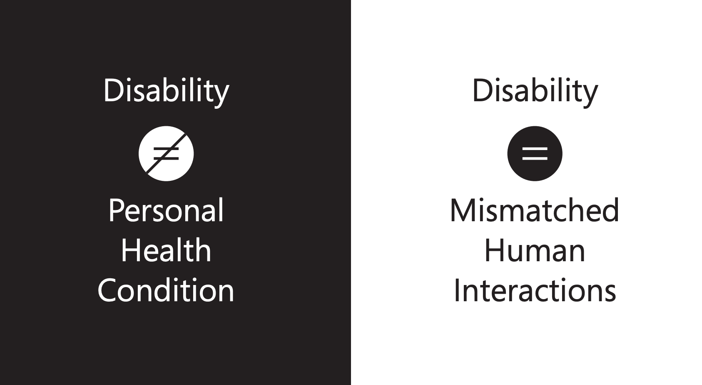

过去几个月偶然参与到一个用 Voice UI 辅助视障人群化妆的项目。脑暴主题的时候，最初想着语音很适合作为视障人群的“眼睛“来反馈无法经由视觉反馈的信息，因此大家决定以这个用户群作为切入点。但我从未想过视障或盲人会和化妆有什么关联。既然看不见，肯定就不会去做这样强烈依赖视觉反馈来完成，而且自己还无法欣赏成果的事情吧？但是等到做过一系列调研后，才发现自己之前的想法完全是一种偏见。不仅 [Youtube](https://www.youtube.com/watch?v=xvOZQweFOZg) 上就有很多盲人女孩博主分享化妆技巧，后来还视频采访了一位视障女孩，看着她化妆的时候，就觉得感动。

我们自己也每人闭着眼做了一回模拟体验，发现不借助视力化妆这件事没有想象中那么“不可能”，但也发现很多痛点：不少化妆品容器设计得精致却复杂，很难仅仅通过“摸”来弄清楚怎么打开；当你看不见眼影盘上一格格的颜色时，只能通过记忆和手来找到想要的颜色；五官中最难画的部分是眉毛，因为眉骨的形状常常会把人带跑偏；化妆品的形状大同小异，除非自己非常熟悉，否则只能在别人的帮助下从一堆化妆品中找到正确的那个。化妆品设计师们大概也没想过盲人会用他们的产品吧。不过即使知道了，他们会因为”用户太少“而忽略吗？毕竟我们在设计界面的时候也经常会忽视有特殊需求的少数群体啊。

无障碍这件事，好像是来了美国才有比较多体会。在国内的时候，虽然也能看见一些努力（比如无障碍公共设施），却很少看到真正在使用的人，似乎这群人因为太多“不方便”被我们从日常生活场景中抹掉了。在美国，大概因为人种本身就有多样性，看到的是不太一样的一面。路上并没有刻意设置的盲道，却经常看见独立行走自如的盲人。公交车的上车台阶会为小孩或身体不便的人下降，有时候坐轮椅的人上车很慢也没人抱怨，有时候碰到导盲犬躺在座位下陪着主人。黄色校车停在十字路口，所有路口的车都停下来等着，直到下车的小孩安全穿过马路走到路边。公共建筑里需要推拉的玻璃门旁边有无障碍按钮，入口和室内的台阶旁都有斜坡。街上偶尔能遇到用义肢行走的人，甚至穿着石膏鞋跑步的人。

写到这里，突然想到很多关于无障碍设计有关的词语: accessible design, design for disability, inclusive design, universal design…… 很喜欢的一个关于 disability 的定义来自微软的一个 [inclusive design 的小册子](https://www.microsoft.com/design/inclusive/)：Disability = Mismatched Human Interactions。“障碍”不等同于个人健康状况，而是那些与人不匹配的交互。

以前看过一个相关主题的视频，说到为什么设计的包容性 (inclusiveness) 重要，因为它并不只是关于要考虑少数特殊人群，而是在为每个人一生中不同阶段、不同状态、不同场景下可能会遭遇的障碍而设计。这种”障碍“可能是由于年龄、疾病、事故造成的视力、听力、肢体不便等生理障碍，也可能是站在阳光下看不清屏幕上的字，开车的人无法分心阅读屏幕上的导航路线，在车站因为拎着大小行李只剩一只手操作自动售票机，或是因为高矮胖瘦肤色不同而被某个系统规则排除在外。

所以 inclusive design，与其说是为更多人设计，不如说是为自己设计吧。为自己曾经是小孩、以后会变老，以及当下不那么舒适的时刻而设计。
