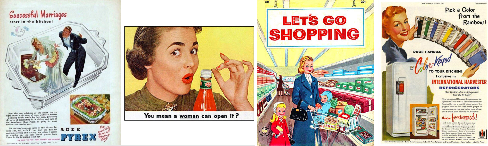

#### “假如一个城市断掉一天的汽油供应会怎样？”

这是我们在「Design for Complex System」第一节课上被问到的问题。

大家罗列了很多受影响的结果：很多人开不了车，地铁人满为患，公共交通系统会瘫痪，人们工作上学出行困难… 能想到的几乎都是负面影响。但容易忽略掉的是，因为一天里汽油燃烧变得少了，空气质量可能会变好一点。

在考虑这样一个城市系统时，你无法只关注某个变量或因变量，也很容易忽视某个变量。各个因素都有千丝万缕的联系，它们互相连接、影响、联动。有一些是可预知的，还有一些是未知的。这个巨大系统实在太复杂，甚至于理解它是如何运作、分辨有哪些关键因素都非常难。

这就是复杂系统，Complex System。它是动态的，系统中的节点互相依赖，而且不存在单一的最佳解决方案。还有一类复杂系统，叫 Intricate System，只是原理或知识性的复杂，只要对领域知识足够了解，就能得到唯一的解决方案。比较起来，intricate system 是一台电脑的硬件系统，而 complex system 是一个社区、一座城市、一个国家、这个地球。

最初知道复杂系统这个概念，是几年前听了 Edx 上一节关于如何为复杂系统设计的课，当时被「系统中各个因子动态依赖，互相影响，施加于一个点的解决方案不再起作用」震撼了一下。今年旁听了几节关于 Social Innovation 以及 Design for Complex System 的课，了解越多，越觉得这个领域有意思和有挑战性。了解 Complex System 于我的意义是，它提供了一个看待事物的新框架。在这个框架里，很多以前被忽视的东西进入视野。简化问题不再起作用，只能身处系统里，与它本身的复杂性共处，想方设法理解或干预。

#### “人们用自己没有的钱来购买自己不需要的东西，以打动那些并不在乎他们的人。”

> There are professions more harmful than industrail design, but only a very few of them. And possibly only one profession is phonier. **Advertising design, in persuading people to buy things they don't need, with money they don't have, in order to impress others who don't care, is probably the phoniest field in existence today**.
>
> —— Victor Papanek, Design for the Real World, 1971

维克多的这段话很有警示意义：广告设计大概是最有欺骗性的领域，因为它的目标是说服人们透支信用卡，买他们实际上不需要的东西，来打动哪些根本不在乎的人。回看美国消费主义盛行年代的广告，现代人可能会觉得夸张好笑，但不可否认广告设计对于消费者尤其是女性心态的操控，它们使用最能击中你的一点，使你相信「我真的需要这个」「买了它就能拥有幸福」。

对复杂系统的研究，与对消费主义的反思也有关系。制造消费主义泡沫的工具之一是「计划性过时」（Planned Obsolescence）。为了追求利润增长，品牌需要不停推出新产品、逐渐减少对旧产品的支持来刺激消费者更新换代。在这个过程里，我们的注意力被新产品的广告所吸引，以导致我们忽视了这些商业产品也处在一个更宏观的复杂系统里，而这个系统里还有很多别的东西。

####“以人为中心的设计就是以人类为中心的设计。”

设计师 Jussi Pasanen 在他的博客 [Human Centered Design Considered Harmful](https://www.jussipasanen.com/human-centred-design-considered-harmful/) 里写到，这些年所有我们称之为颠覆性的服务创新都有明显的负面影响。

> ...Airbnb also [skews housing affordability](https://www.abc.net.au/news/2018-11-08/airbnb-not-worsening-rental-affordability-sydney-melbourne/10474580) in many cities. It facilitates mass tourism with [many negative impacts](https://www.theguardian.com/commentisfree/2018/aug/31/airbnb-sharing-economy-cities-barcelona-inequality-locals) on local communities. It also increases demand for aviation and other carbon-intensive transport, consequently adding to global emissions and fuelling climate breakdown.
>
> ...Uber considers its drivers ‘driver partners’ rather than employees to maximise flexibility and to [avoid paying them employee benefits](https://www.forbes.com/sites/omribenshahar/2017/11/15/are-uber-drivers-employees-the-answer-will-shape-the-sharing-economy/#3d7db7f75e55). At first glance, their service may appear like a marketplace, however it most certainly is [not a real or a level one](https://medium.com/humane-tech/tech-and-the-fake-market-tactic-8bd386e3d382). Uber forces traditional taxi operators out of business, impacts drivers’ livelihoods, and [increases traffic congestion](http://www.schallerconsult.com/rideservices/automobility.htm) in cities like New York.
>
> —— Human centered design considered harmful

这大概就是单一产品被引入一个更大的系统中时会产生的挑战。这个模型类似人们在一个生态系统里引入外来物种时，只考虑了部分直接结果，期待用引入的生物来控制另一种生物，而没有或根本无法考虑周全这个复杂生物链里的其他变量，最后物种引入变成了物种入侵。

Jussi 的结论是，以人为中心的设计本质上就是以人类自己为中心的设计，我们更加方便、快捷、舒适、快乐的体验，都是以这个星球上的其他自然事物的消减为代价而换取的。而我更好奇的可能是，怎样才能平衡人造产物「带给人自身的便利」与「带给复杂系统的问题」？

都说设计是在混乱中创造秩序。复杂系统给我的启示是，只有看到并理解更宏观的混乱，才能创造真正有意义的秩序。
