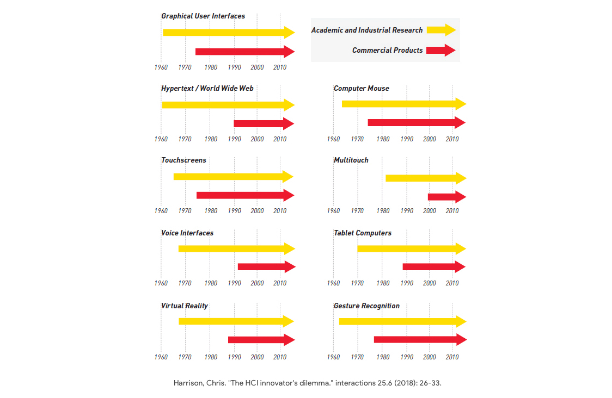

这学期选修了 HCI 一门基础却有趣的课 Design for Human-Centered Software，摘录一些印象深刻的课堂笔记。

### 历史

Vannevar Bush 在 1945 年写了「As We May Think」，描述了一个假设的系统 [Memex](https://en.wikipedia.org/wiki/Memex)， 提出了很多对未来人机交互的预言，而这些预言好多都成真了。比如会有可以语音识别的 Supersecretary（即今天的 Alexa/Siri），体积小且移动式的摄像机（即今天智能手机的自带相机）等等。

Grace Hopper 在 20 世纪 50 年代最早发明了编译器，为后来更高级的编程语言奠定了基础。近些年美国的 Grace Hopper 大会就是对她的纪念。

Doug Engelbart 在 1964 年发明了鼠标，以及开发了首个「在线系统」（NLS），功能包括 bitmapped screens, files, word processing, revision control, hypertext, collaborative editing, video conferencing, many other precursors to the GUI，被称为「the mother of all demos」。

在研究领域，触摸屏诞生于 1965 年，VR 是 1968 年，压感触摸屏是 1976 年。而第一台商用的可用触摸屏电脑诞生于 1982 年，多点触控是 1985 年（CMU）。学术界总是领先商业界很多，印证了 Bill Buxton 的话「任何未来十年会产生重要影响的技术现在已经至少存在了十年」。Prof 讲到这里调侃说，不是所有东西都是苹果发明的…

### 设计

有一节课专门讨论了设计实验里的道德问题。2012 年 Facebook 的数据科学家操纵了近 70 万用户的 News Feed，给其中一半人只显示积极正面的 post，另外一半只显示消极负面 post，以研究 post 的内容会不会影响人们的情绪。这个 A/B 测试是不是道德的？

也讨论过要提防设计里的幸存者偏误。人们常说老车老建筑更好看、八十年代的歌更好听，但可能是因为只有那些最好的老车、老建筑、老歌才被留存了下来被我们看到，并不能代表那个年代的平均水平。因此在设计时，当我们观察人、过程或事物时，要小心观察到的可能只是「存活」下来的那一小部分。

在讲到「颜色」时，老师分享了一个很有意思的研究，「奥德赛」这部古老著作里包括各种形容颜色的词语，但没有找到任何和蓝色相近的字眼，于是人们猜测蓝色这种颜色对于人类历史来说还很新。另外有一个研究 Himba 部落住民对颜色认知的实验（[这篇文章](https://www.gondwana-collection.com/blog/how-do-namibian-himbas-see-colour/)有介绍），研究发现当地人很容易分辨出有微小差别的绿色，而很难从一堆绿色中分辨出蓝色，非常神奇。也就是说，对颜色的认知可能会受到文化的影响。

不仅颜色，同一个图形也会在不同文化里产生很不一样的理解。这意味着如果要为不同文化的人做设计，我们需要使用更通用的图形或设计语言。

隐喻在设计里用好了很好，用得不好就适得其反。正面例子是「购物车」，失败案例则是微软在 1995 年推出的 [Microsoft Bob](https://en.wikipedia.org/wiki/Microsoft_Bob) 操作系统，用 3D 视角呈现了一个家的隐喻，以及一只卡通狗形象的助手，结果非常低效难用。

之前不知道的一些通过观察来发现需求的方法，以后有机会可以尝试：Life-logging, Diary studies, Camera probe, Experience sampling, Elicitation studies, Crowd-sourcing...

一些用来评估设计好坏的维度或工具，在产品批判里很有用：

- Gestalt Principles
- 10 Neilson Heuristics
- Usability: learnability, memorability, flexibility, robustness, pleasing, out-of-the-box experience, fun...

### 输入输出

QWERTY 键盘布局最早是为了降低打字员的打字速度，以防止老式打字机卡住（1868 年），而它后来被用在了第一台成功的商用打字机上。发明者 Sholes 没有预料到这个布局可以让人们打字比写字还快。又过了大概十年后，用十个手指头敲键盘开始流行起来。问题来了，为什么都过了 150 年，我们还在用 QWERTY 的布局？其实也有很多其他的键盘布局被发明出来，有比 QWERTY 更高效的，但好得都不够明显，而且人们已经习惯了这个布局。你愿意从头学习一种声称可以比 QWERTY 快 10% 的键盘吗？大概率不会，因为其中的投资回报比提升实在不够显著。

机器的信息输出可以通过我们的五感来接收。视觉的部分，有一个很有趣的实验项目 [IllumiRoom](https://www.youtube.com/watch?v=aA5dNoangbo)，通过投影把客厅电视的周边空间改造成了与播放画面联动的增强现实，沉浸感效果非常惊艳，适用于游戏场景。VR 游戏需要佩戴 VR 头盔，而这种方式不需要，可实现多人分享式的游戏体验。

### 人因

Rule of Four and a Half 是说人类擅长识别 5 个或 5 个以下个数，而不擅长 5 个以上的（大概因为人类有 5 根手指）。这个理论被广泛应用到各种菜单或按钮布局的设计中，比如老式键盘顶部的功能键，Mac OS Finder 窗口顶部的默认按钮，或是很多软件的下拉菜单。

在设计时，尽可能让用户「识别」而不是「回想」：

- Recognition: using a sensory cue to remember something
- Recall: remembering something in your mind from memory without a cue

在人机交互中，小于等于 100ms 按人的感知是「即时反应」，小于这个值后人眼几乎分辨不出来；大于 5s 就不行，需要显示进度——这和人人交互是类似的：人们面对面聊天时，如果有一方超过 5s 还没有回应，另一方一般会感到不太自在。

心理学中有一个发现叫做 Peak and End Effects，是说人们在评估过去的某段经历或体验时，一般不是基于体验的总和或平均值，而是基于这段体验的最高点和尾声。这个效应在设计里用的也很多，比如进度条的设计。

### 体验

[Prof. Harrison](<https://en.wikipedia.org/wiki/Chris_Harrison_(computer_scientist)>) 可能是个精力无限的教授，整个学期下来由于他讲课超快语速，我的英语听说有了质的飞跃。除了这篇文章里提到的，还从这个课里了解到好多人机交互的发明、实验和轶事，都让人眼界大开。尽管经常有突如其来的随堂 Quiz，依旧是一门非常值得推荐的、信息密度大、基础却很有意思的 HCI 课。

另外，十二周的课包含四次 Bakeoff（每个是大约为时两周的设计挑战），和不同的人合作，一学期完成了四种有趣而不同的交互发明：Pointing，4DOF Manipulation，Tiny Typing 和 Sensor Madness。每次 Bakeoff 课上角逐出最佳结果后，Prof 会颁发自己手工制作超级夸张的奖杯。图片里是最后一次 Bakeoff 的决赛，我在的组第一次进入决赛，尽管最终没能夺冠 lol。

