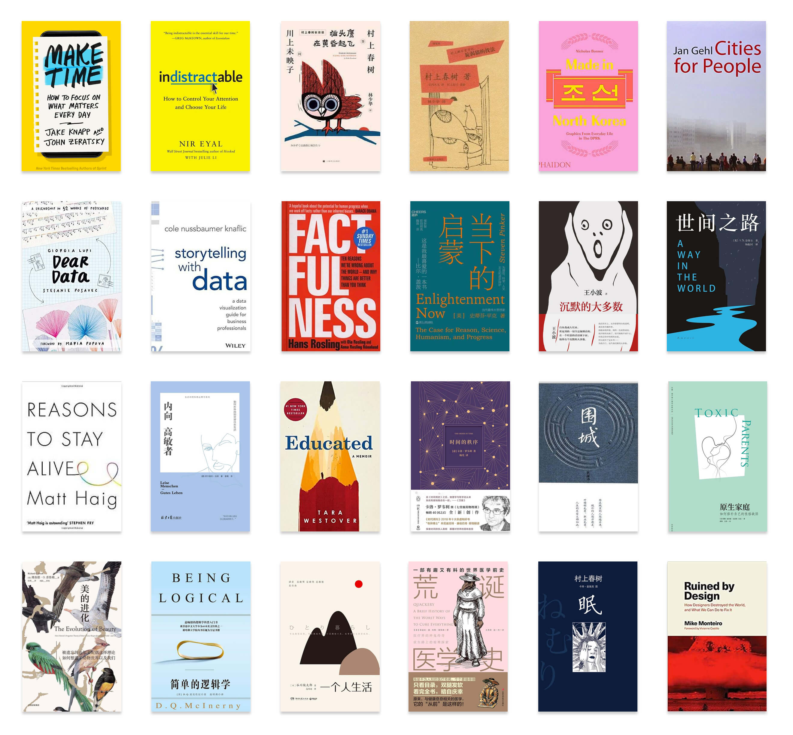
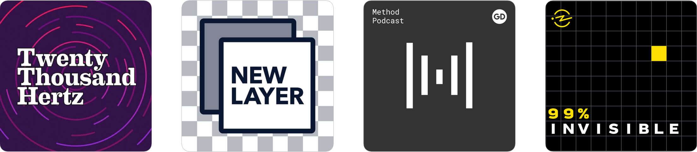
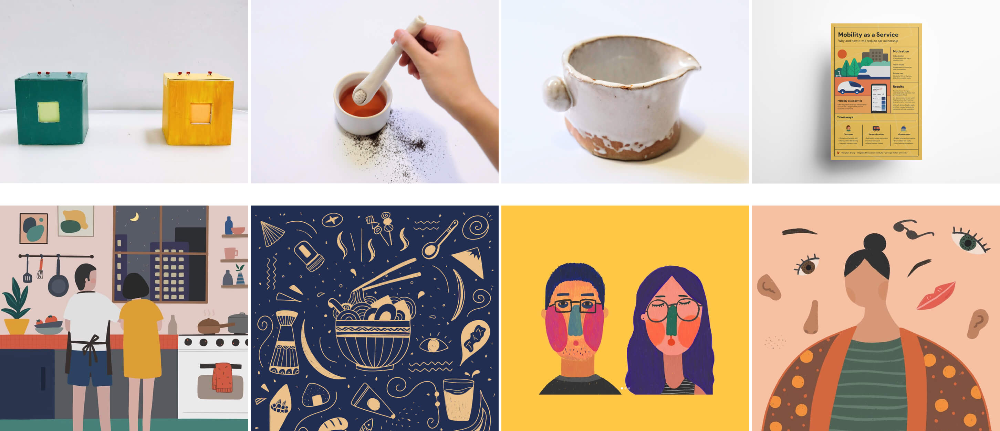

### 书

今年看过的书没有往年多，有超过一半的书是在十一月里看的，正值毕业论文要到交稿日期，只好借看书来拖延。

大部分时候不读书是没有找到足够有趣的书来读，有读书的热情却没有选书的耐心。书荒的时候就随便找本村上春树来看。今年看了一本旧杂文，一本翻译不佳但内容耐人寻味的访谈录，还有一本他多年前经历创作瓶颈后写的短篇。很多人说村上春树写来写去都是类似的东西，他在访谈里借博尔赫斯的话说「诗人想写的东西，一生当中只有五六种。我们仅仅是以不同的形式重复罢了！」但在重复过程中，形式和品质、广度与深度都会有所不同。这么想来，也不无道理。

另外一些书来自于机缘巧合，比如《Storytelling with data》和《Dear Data》就是因为选修一节课未果，自己找来读的两本书。前者偏向技术型的方法论，很快可以翻完，而后者就非常浪漫。《Dear Data》记录了两个设计师进行的[为期一年的一个项目](http://www.dear-data.com/theproject)：每周她们会用手绘数据可视化的方式展现生活中的一个共同主题，然后画在卡片上寄给对方，呈现方式非常有创意，完全颠覆了我之前对「数据」的冰冷理解。

《Factfulness》 和《当下的启蒙》是碰巧一前一后看完的，发现它们很适合互为补充。两本书的核心都是在打破人们的固有认知，用数据事实论证世界各方面都在进步。

《沉默的大多数》太好了，好到只能推荐每个人亲自去读。《围城》也很好，里面的比喻最精妙，比如像「忠厚老实人的恶毒，像饭里的砂砾或者出骨鱼片里未净的刺，会给人一种不期待的伤痛」这样的句子。

今年读过的书全列在下面了，最大的一个体悟是，不要浪费时间在读不下去的书上。另外，选书真是一件碰运气的事儿。

### 播客

Spotify 2019 的年终盘点显示今年我听了一千多分钟的播客，比听音乐的时间长。今年发现的最令人惊喜的是 [Twenty Thousand Hertz](https://www.20k.org/)，以声音设计为主题。当我们听大部分播客时，听的是人们的交谈和背景音乐，而这个播客把所有这些元素打破、剪切、编排成了一种丰富而愉悦的听觉体验。推荐 [#62 The Booj](https://www.20k.org/episodes/thebooj)，虽然每一集都一样「好听」。

[New Layer](https://anchor.fm/new-layer) 是一对产品设计师夫妻 [Tanner](https://twitter.com/tannerc) 和 [Jasmine](https://twitter.com/jazzy33ca) 创办的产品设计播客，每集探讨的主题从如何在面试时问问题到如何多花时间思考，很适合处于职业生涯早期、对很多东西都有迷思的设计师。另一个听得比较频繁的、与设计相关的播客是 [Method](https://design.google/library/podcasts/)，内容包括访谈各产品团队的设计师和用户研究员，是了解 Google 各团队设计的一手信息来源。

[99% Invisible](https://99percentinvisible.org/) 属于虽然只是偶尔会听却不舍得取消关注的那类。有一集讲图书馆之类的建筑除了自己本身的实质性功能，也是一个区域的社交场所，要怎样利用这些带有社交属性的公共空间来促进人和人之间的交流。另一集讲了美国城市里的松鼠，才知道这边很多松鼠是很早以前人工引进的，并且纽约中央公园有一种职业就是数松鼠，听起来非常好玩。

### 别处

二月因为面试又去了趟纽约。没了初次见面的新鲜感，眼里都是重复的细节：密不透风的高楼，年久失修的公共设施，建筑工地的脚手架，地面烟囱里涌起的雾气… 这类场景在各大街道被不停复制，容易营造出一种在杂乱中应付不过来的审美疲劳。好在那股欣欣向荣的劲儿还是迷人的，以及那种让人感到自在的包容性。

夏天实习结束后，[坐海岸星光号](https://www.youtube.com/watch?v=Y4MS2-V3mZ4)从 San Jose 出发，沿途路过了田野、山丘、湿地、油田、海滩，最后到达海滨小镇 Santa Barbara。四百多年前，西班牙探险家胡安不远万里航海抵达这里，把它命名为 Santa Barbara，直到十九世纪这片土地才归为美国所有。Santa Barbara 真是个奇妙的地方，购物中心走到尽头就是一望无际的棕榈树和沙滩，印象里太阳底下只有蓝白两色。

之后往南去洛杉矶，当了一回游客。去了天文台，植物园、海滩，晒黑三圈。碰巧住在一个纪录片导演的家里。房子里除了她一家，还有好几只猫，以及两个从英国来度假的女孩，是他们的侄女和侄女的朋友。早上女主人烤了面包，大家一块儿坐在餐桌边上，聊了她正在拍的片子，讨论了英国北爱尔兰，和有关墙上汉字书法挂画的轶事。

十月因事在费城住了几天，除了对民宿不太满意，整个体验超出预期的好。尤其喜欢 Rittenhouse Square 和它附近的那片区域，傍晚的时候随意步行就能发现很多惊喜，氛围也是活泼的，总之在别的城市感受到的一些矛盾点在这里都平衡得挺好。去历史悠久的 Elfreth's Alley 闲逛时，一个老奶奶在确认我们懂英语后热情洋溢地讲了大半天历史，一边讲一边不时轻拍我的手臂，也是很有趣。

十二月在 Palo Alto 待了两天。由于这附近暑假时来过，别的新鲜感没有，只是一看见高高的棕榈树和粉色晚霞，再想想东部的阴雨天，就会在心里感叹「还是加州好啊」。

### 产出

今年大部分产出来自于上过的课。上半年 IoT 课上做的两个项目印象最深刻：一个是连接远距离的人们且反焦虑的慢游戏 Pixel Away，另一个是 Studio 里会吐出消息的储物柜。Capstone 项目也在上半年圆满结束，虽然过程中有很多的折返迷茫，以及合作上的摩擦，最后还是共同产出了一个让客户满意的解决方案。Digital Ethnography 我们小组选的主题是研究 Instagram 上的 pet influencers。为了更好地了解当一个运营宠物帐号的主人心态，我们「领养」了一只 therapy husky，给它创建帐号、发照片，以及去线上私信采访那些宠物大 V 们，最后把所有发现写成了[一篇文章](https://medium.com/@melodiezhang/unraveling-the-mystery-behind-pet-influencers-c6b5a2cdb7c2)，可以说是最享受过程的一个项目。

秋季学期只选了三门课：信息密度很大的 [Design for Human-Centred Software](http://melodiezhang.com/post/hci-ke-tang-bi-ji)，自由散漫的 Industrial Design Practice，和枯燥必修的毕业论文。工业设计实践完全是被课题吸引了— 重新设计珍珠奶茶的饮用体验，以及其中一次去学做陶瓷的机会。毕业论文因为是自定主题，我选了 MaaS（Mobility as a Service），深入了解这个话题后觉得很有趣，这也是头一次写七千多字的英文论文。

除此之外，业余更新了博客，画了插画，还有一个 Chrome 扩展插件的小项目正在进行中，希望明年初能完成。

### 工作

暑假在 Google 实习了两个多月，结束时完成了转正面试，接着是漫长的 team placement 等待。十月份 Facebook 来校招，递了简历，电面后又是漫长的两个多月的等待，期间原打算面的 Messenger 组招满了，剩下的只有 Ads & Business Platforms，觉得去了解一下也不错，于是在学期末的时候去了 Menlo Park onsite。Onsite 回来后，一边忙期末的事情，一边等面试结果以及 team match。最后在毕业那天 Facebook 给了 Offer，然后 Google 也匹配到了想去的组。

以前一直觉得 Facebook 是 dream company，因为从他们产品设计师的输出里学到了很多东西，比如 Julie Zhuo 的文章就给过我很大影响。面试的时候听说她马上就要离开了，有些意外。更多了解之后，感觉 Facebook 工作氛围最典型的特征就是自下而上、重数据、重影响力、ownership，但同时可能也有因人员流动性大、节奏快而导致的不确定性和责任边界的模糊。

Google 这边最早是和匹兹堡的 Shopping 组接触了下，了解到主要是做搜索的 shopping tab，是一个还比较早期的小团队。后来又有机会联系到了在 MTV 的 Chrome OS 组，和 manager 聊过后觉得他们做的事情很有挑战性和影响力。相比渐进式改善单一产品提升数据指标，设计操作系统更像是设计一个容器，需要考虑的东西很不一样。一些挑战包括怎么改变人们「Chrome OS 只能在线使用」的认知，让 Chrome OS 成为随时使用的生产力工具？目前 K-12 教育市场中 Chromebook 有六成的占有率， 怎样进一步提升它的体验来覆盖企业工作场景？除此之外，很幸运提前和团队里的另外几个人也聊了聊。第一个聊的是 [Sebastien Gabriel](https://twitter.com/kounterb)，几年前就读过他 [Redesign Chrome 的文章](https://medium.com/google-design/redesigning-chrome-desktop-769aeb5ab987)；第二个是 UX Coffee 的 Co-host Kejia。没有想到这些以前觉得很远的人，当下却机缘巧合有机会共事。和团队里的人聊过后，差不多就做了决定。

### 毕业

在匹兹堡待满十六个月后，终于毕业了。因为是冬天毕业，没有穿戴学位服授予学位的仪式，取而代之的是一个小型的 luncheon：聊天，用餐，拥抱，鼓掌，握手，合影。

还是要不可免俗地感叹一句，时间过得太快了。第一天 orientation 的尴尬场景还历历在目，眼下还没熟悉起来就要互相道别了。虽然 MIIPS 不能说是一个完美的项目，但这段经历还是让我收获挺多。这种收获对我来说是知识上的，也是心态上的。想起实习时，一位设计师校友对当时深受 Impostor syndrome 困扰的我说 "Be confident. You are from CMU! You should be proud!"

每个离开的地方到了后来都会成为某种意义上的故乡，在的时候想着逃离，家具也不屑多买几件，等走了之后又来怀念。身边同学感叹毕业终于得闲去逛安迪沃霍尔博物馆的时候，才发现校园卡的免费 access 过期了。我知道再过不了多久，学校的邮箱也会失效，新分配的邮箱地址会添上 alumni 的后缀。这意味着一段旅程结束，新的冒险开始。与此同时，很感谢过去这一年多遇到的人和经历的事，让我看见了一个不管是在比喻还是实际意义上都更大的世界。

2020 听起来好有科幻感，而它马上要到来了。回想起来，2010 年我才刚开始上大学。这十年从大学到国内工作再辗转到美国念书工作，有好多新尝试、新见识、新体会，然后在各种扑腾迷茫失落欢喜过后尘埃落定。十年里遇到了形形色色的人，想感谢的人很多，但最想要感谢的是小葛同学，感谢我们成为彼此相互依赖的伴侣和无话不说的伙伴。期待下一个十年，我们继续好好生活，一起探索，成长，和傻笑。
