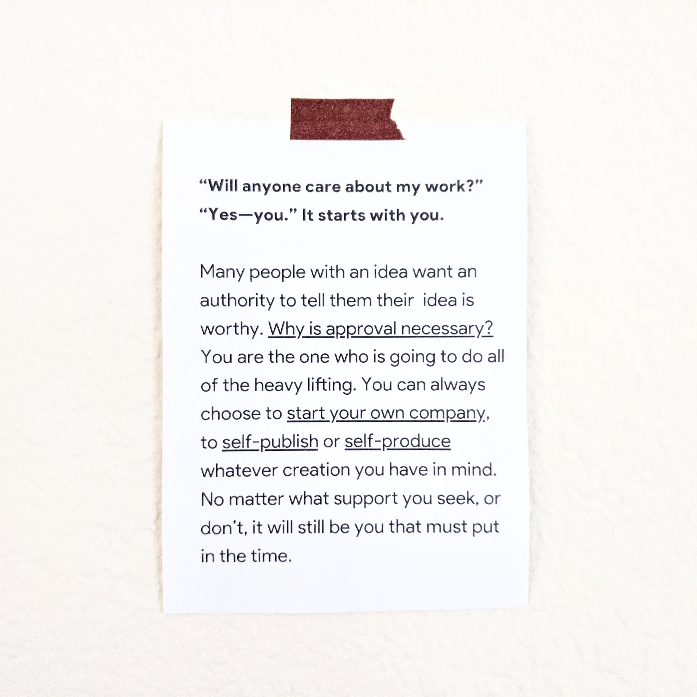
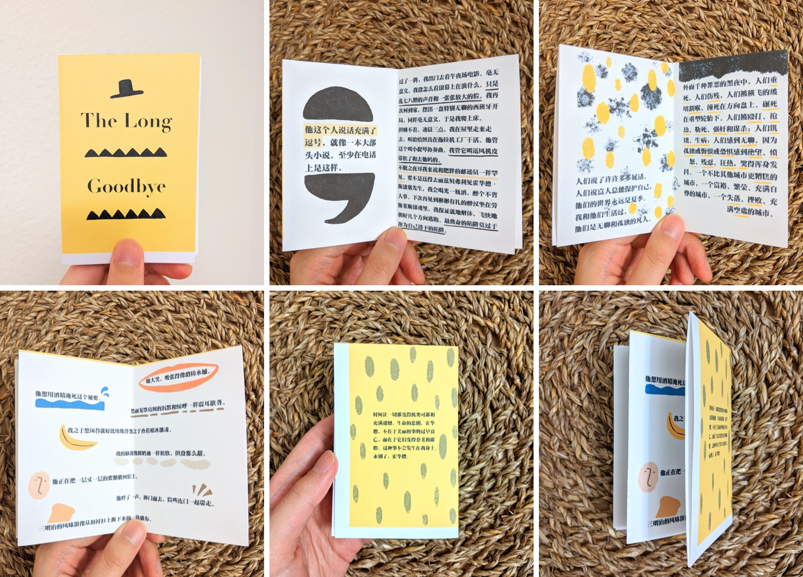

从美国疫情爆发开始在家办公，到现在三个月过去了。困在家里的安宁，和新闻报道的嘈杂形成反差，偶尔忘记自己身在何处。好在在各种不确定的缝隙里，至少还有书可读。

### [No Filter](https://www.simonandschuster.com/books/No-Filter/Sarah-Frier/9781982126803)

讲 Instagram 从创始到现在的故事：Instagram 如何被收购，Facebook 和 Twitter 之间由来已久的竞争，Twitter 收购的 Vine 为什么失败，为什么 Instagram 一直简约克制，而它又是如何移植 Snapchat 的 Stories 的… 

有一段讲 [Kevin Systrom](https://twitter.com/kevin)（Instagram CEO），[Jack Dorsey](https://twitter.com/jack)（Twitter CEO），和 [Ev Williams](https://twitter.com/ev)（Medium CEO，曾短暂取代 Jack 担任 Twitter CEO）的插曲挺好玩。Instagram 创始人 Kevin 曾经在 Ev 创办的公司 Odeo 实习，Jack 这个时候也是 Odeo 的一名工程师，他是 Kevin 的 mentor，这俩人后来成了关系不错的朋友。几年后 Instagram 刚做出来的时候，Jack 很喜欢，每天都要发几张照片。后来 Jack 和 Ev 商量想让 Twitter 收购 Instagram，Ev 不太乐意。后来，当 Kevin 在没有事先知会 Jack 的情况下，把 Instagram 卖给 Facebook 时，Jack 非常生气，直接把 app 从手机里删掉了。

另外最有意思的，可能是 Kevin Systrom 和 Mark Zuckerburg 之间从理念到处事方式的差异。一个追求完美，极简克制，会为了美观亲手 PS 广告商的物料；一个追求数据与扩张，好胜心强，要么收购要么杀死对手。Instagram 是 Kevin 的缩影，Facebook 是 Mark 的缩影，或许正是这种价值观差异注定了最后的分道扬镳。看的时候止不住想，如果 Instagram 当初被 Twitter 收购了，现在会怎么样呢？

### [Speculative Everything](https://mitpress.mit.edu/books/speculative-everything)

设计就是解决问题吗？不一定。作者提出一个概念叫推测设计（speculative design，又译作思辨设计），它由批判性设计（critical design）衍生而来，主张设计作为一种工具不止可以用来解决问题，而用来创造一个辩论的空间，来探讨除当下以外其他的存在方式，鼓励人们自由思考和想象，推测未来。书中充满了概念性设计的例子，但概念不仅仅只是一个 idea，而是理想状态（ideal），我们应该用理想来衡量评估现实，而不是反过来，觉得理想化的是无用或不切实际的。

一个让我印象深刻的例子是，2003 年两个艺术家 Shiho Fukuhara 和 Georg Tremmel 提出一个概念设计：在人死后，作为一种纪念，可以把这个人的 DNA 注入一颗苹果树，这棵树就成为了活着的墓碑。从科学角度来讲，向一颗苹果树注入人的 DNA 并没有太大意义，但从人的角度来看，可能不失为一种更有人情的纪念。通过提出这一概念，人们就会开始反思这一未来的可能性，对技术伦理进行辩论，从而挑战现实。

### [The Dance of the Possible](https://scottberkun.com/2017/the-dance-of-the-possible/)

关于创造力的一本小书，喜欢它简短有力，鸡汤与鸡肉并存。创造力是什么？说白了就是「做有趣的选择」。我们花太多时间尝试变得更高效，以至于做点有趣的事情都感觉是在浪费时间。

### [Show Your Work](https://austinkleon.com/show-your-work/)

Steal Like an Artist 的作者 Austin Kleon 写的，关于如何在现在互联网上分享你的创作：

- 大家都是业余者，没必要有包袱。去尝试，犯错，失败，然后学到点什么。They're just regular people who get obssessed by something and spend a ton of time thinking out loud about it.
- 个人网站不是用来自我推销的工具，而是自我创造的工具。
- 除了你的创造的作品外，你读什么，看什么，喜欢什么，也都是你的一部分，不妨大方分享。

### [Atomic Habits](https://jamesclear.com/atomic-habits)

2020 年结束前不会回办公室工作了。长期居家办公的挑战是，如何建立起一套新的系统，来适应在同一个空间既工作又生活。这本书给我很多启发。上篇文章也提到过，建立有效习惯的四个要素是：让它更明显，有吸引力，容易重复，且能让人产生满足感。

可以拿来当作例子的是近期养成了站立办公的习惯。首先是站立办公桌让频繁的站起坐下切换变得很容易，最近又买了一个 [balance board](https://fluidstance.com/) 让站立这件事变得更有趣，现在平均每天只有不到 1/3 的时间是坐着的。

### [漫长的告别](https://book.douban.com/subject/30316475/)

今年的第一本虚构小说，搁在想读清单里很久了。真正让我产生兴趣的是村上春树在《猫头鹰在黄昏起飞》引用的一个比喻句：「不眠之夜对我来说和肥胖的邮递员一样罕见」。认真读起来果然也没失望，钱德勒的描写太妙了，几乎所有的比喻，人物，心情描写都想要画下划线，翻译的功底也了不起。故事本身也够精彩，尽管在三分之二的时候已经模糊猜到凶手是谁，但单凭小说语句人物台词的节奏，就够让我饶有兴致地读下去。难怪村上春树把它翻来覆去看了十几遍。

挑了喜欢的句子，做了一本 mini-zine :)

